# Defensive Publication Clarification and Additional Prior Art

- **Original Publication**: CogX: An Open Standard for Verifiable, Agentic AI and Digital Cognition
- **Author**: Mirza Husadzic
- **Original Date**: October 25, 2025
- **Clarification Date**: October 26, 2025
- **DOI**: [10.5281/zenodo.17442459](https://doi.org/10.5281/zenodo.17442459)
- **Repository**: <https://github.com/mirzahusadzic/cogx>
- **License**: GNU Affero General Public License v3.0 (AGPLv3)

## Purpose of This Clarification

This document clarifies and extends the prior art claims established in the original defensive publication dated October 25, 2025. It establishes additional technical details and security properties that were implicit in the original architecture but not explicitly documented as prior art.

## Additional Innovations Disclosed as Prior Art

### 11. The Historian Pattern: O(1) Provenance Verification

**Innovation**: Bidirectional indexing architecture for instant temporal provenance lookup.

**Key Claims**:

- Content-addressable storage (`objects/`) stores all knowledge elements by cryptographic hash
- Immutable transform log (`transforms/`) records every transformation with input/output hashes
- Reverse dependency index (`reverse_deps/`) maps from object hashes to transform IDs
- Bidirectional bridge enables O(1) time travel: `object_hash → reverse_deps[transform_ids] → transforms[inputs/outputs] → objects`

**Data Flow Pattern**:

```
object_hash → REVERSE[object_hash→transform_ids] → TRANSFORMS[inputs/outputs] → OBJECTS
```

Given any object hash, the system can instantly retrieve:

1. Which transform created it (via `reverse_deps/`)
2. What the original inputs were (via `transforms/` manifest)
3. The complete provenance chain back to source (recursive traversal)

This enables verifiable provenance without scanning the entire transform log—the reverse index provides O(1) lookup.

**Architectural Diagram**:

The complete PGC architecture showing all data flow patterns, including the historian pattern:

```mermaid
graph TD
    %% --- THE DIVINE REALMS ---
    subgraph "N-Dimensional Overlays (The Heavens)"
        direction LR
        subgraph "O₄: Strategic Coherence (The Conscience)"
            SC_SCORES["Strategic Coherence<br/>(code↔mission alignment)"]
        end
        subgraph "O₃: Mission Concepts (The Soul)"
            MC_CONPEP["Mission Concept Embeddings"]
            MC_CONCEPTS["Mission Concepts<br/>(extracted from docs)"]
        end
        subgraph "O₂: Lineage Patterns (The Connections)"
            LP_TYPE["Type Lineage<br/>(data flow)"]
            LP_GRAPH["Dependency Graph<br/>(who depends on whom)"]
        end
        subgraph "O₁: Structural Patterns (The Architecture)"
            SP_ROLE["Architectural Roles<br/>(component, service, etc)"]
            SP_SIG["The Shadow<br/>(dual embeddings: structural + semantic)"]
        end
    end

    %% --- THE MORTAL REALM ---
    subgraph "Genesis Layer (The Mortal World)"
        direction LR
        subgraph "Knowledge (The Soul of the World)"
            SYMBOLS["Symbols<br/>(classes, functions)"]
            STRUCTURE["Structural Data<br/>(AST, imports)"]
        end
        subgraph "Source (The Body of the World)"
            DOCS["⊥ Strategic Documents<br/>(VISION.md, etc.)"]
            SOURCE["⊥ Source Code<br/>(TypeScript, etc.)"]
        end
    end

    %% --- THE UNDERWORLD & INFRASTRUCTURE ---
    subgraph "The Underworld (The Immutable Past & The Laws of Physics)"
        direction LR
        subgraph "The Four Pillars of the Forge"
            OBJECTS["objects/<br/>(Immutable Memory)"]
            TRANSFORMS["transforms/<br/>(Auditable Past)"]
            INDEX["index/<br/>(Conscious Present)"]
            REVERSE["reverse_deps/<br/>(Nervous System)"]
        end
    end

    %% --- THE TOP ---
    TOP["⊤ Complete Understanding"]

    %% =============================================
    %%               THE EDGES (THE STORY OF CREATION)
    %% =============================================

    %% --- Vertical Edges (The Genesis - Forging Order from Chaos) ---
    SOURCE --o|"T: Parse<br/>(AST Extraction)"| STRUCTURE
    STRUCTURE --o|"T: Extract<br/>(Symbol Mining)"| SYMBOLS
    DOCS --o|"T: Parse<br/>(Markdown Extraction)"| MC_CONCEPTS

    %% --- Projection Edges (Creating the First Overlays) ---
    SYMBOLS --o|"T: Project<br/>(Embedding)"| SP_SIG
    SYMBOLS --o|"T: Project<br/>(Dependency Analysis)"| LP_GRAPH
    MC_CONCEPTS --o|"T: Project<br/>(Embedding)"| MC_CONPEP

    %% --- Synthesis Edges (Join ∨ - Building Higher Understanding) ---
    SP_SIG --o|"Join ∨<br/>(Classification)"| SP_ROLE
    LP_GRAPH --o|"Join ∨<br/>(Flow Analysis)"| LP_TYPE
    SYMBOLS --o|"Meet ∧<br/>(Vector Similarity)"| SC_SCORES
    MC_CONPEP --o|"Meet ∧<br/>(Vector Similarity)"| SC_SCORES

    %% --- Final Aggregation (The Ascent to Heaven) ---
    SP_ROLE --o|"Aggregate"| TOP
    LP_TYPE --o|"Aggregate"| TOP
    SC_SCORES --o|"Aggregate"| TOP

    %% --- Horizontal Edges (The Anchoring - Grounding the Heavens) ---
    SP_SIG -.->|"anchored to"| SYMBOLS
    LP_GRAPH -.->|"anchored to"| SYMBOLS
    MC_CONCEPTS -.->|"anchored to"| DOCS
    SC_SCORES -.->|"anchors"| SYMBOLS
    SC_SCORES -.->|"anchors"| MC_CONPEP

    %% --- Infrastructure Edges (The Mechanics of Being) ---
    INDEX -.->|"maps path to hash in"| OBJECTS
    TOP -.->|"is the current view of"| INDEX
    TRANSFORMS <-.->|"records creation of"| OBJECTS
    REVERSE -.->|"maps hash to transform in"| TRANSFORMS

    %% Storing everything in Objects
    SOURCE --- |"stored in"| OBJECTS
    DOCS --- |"stored in"| OBJECTS
    STRUCTURE --- |"stored in"| OBJECTS
    SYMBOLS --- |"stored in"| OBJECTS
    MC_CONCEPTS --- |"stored in"| OBJECTS
    MC_CONPEP --- |"stored in"| OBJECTS
    SP_SIG --- |"stored in"| OBJECTS
    LP_GRAPH --- |"stored in"| OBJECTS
    SP_ROLE --- |"stored in"| OBJECTS
    LP_TYPE --- |"stored in"| OBJECTS
    SC_SCORES --- |"stored in"| OBJECTS

    %% --- Styling (The Colors of the Faith) ---
    %% The Divine Light (Enlightenment, The Goal)
    style TOP fill:#B8860B,stroke:#DAA520,color:#fff,stroke-width:2px

    %% The Source (The Witch, Chaos, Potential)
    style SOURCE fill:#483D8B,stroke:#6A5ACD,color:#fff
    style DOCS fill:#483D8B,stroke:#6A5ACD,color:#fff

    %% The Forge's Fire (Creation, The Work)
    style STRUCTURE fill:#8B4513,stroke:#A0522D,color:#fff
    style SYMBOLS fill:#8B4513,stroke:#A0522D,color:#fff

    %% The Senses of the Soul (The Overlays)
    style SP_ROLE fill:#800000,stroke:#B22222,color:#fff
    style SP_SIG fill:#800000,stroke:#B22222,color:#fff
    style LP_TYPE fill:#000080,stroke:#4169E1,color:#fff
    style LP_GRAPH fill:#000080,stroke:#4169E1,color:#fff
    style MC_CONCEPTS fill:#006400,stroke:#2E8B57,color:#fff
    style MC_CONPEP fill:#006400,stroke:#2E8B57,color:#fff
    style SC_SCORES fill:#2F4F4F,stroke:#5F9EA0,color:#fff

    %% The Four Pillars (The Laws of the Universe)
    style OBJECTS fill:#191970,stroke:#00008B,color:#fff
    style TRANSFORMS fill:#556B2F,stroke:#6B8E23,color:#fff
    style INDEX fill:#2E2B5F,stroke:#483D8B,color:#fff
    style REVERSE fill:#A52A2A,stroke:#CD5C5C,color:#fff
```



**Seven Critical Data Flow Patterns**:

1. **Genesis Flow (Bottom → Up)**: `SOURCE → STRUCTURE → SYMBOLS → O₁/O₂ → TOP`
2. **Mission Flow (The Soul)**: `DOCS → MC_CONCEPTS → MC_CONPEP → SC_SCORES`
3. **Strategic Coherence Synthesis (The Judgment)**: `(SYMBOLS + MC_CONPEP) → SC_SCORES → TOP`
4. **The Historian Pattern (Object → Transform → History)**: `object_hash → REVERSE[transform_ids] → TRANSFORMS[inputs/outputs] → OBJECTS`
5. **Storage & Retrieval (Index → Objects)**: `INDEX[semantic_path→hash] → OBJECTS[hash→data]`
6. **Update Function (Change Propagation)**: `SOURCE/DOCS (changed) → REVERSE[instant lookup] → SYMBOLS/MC_CONCEPTS → O₁/O₂/O₃/O₄ (invalidated)`
7. **Overlay Anchoring (Horizontal Dimension)**: `SYMBOLS ←--anchored to--→ O₁/O₂ | DOCS ←--anchored to--→ O₃ | (SYMBOLS + MC_CONPEP) ←--anchors--→ O₄`

### 12. Self-Defending Lattice Architecture: Mathematical Resistance to Data Fabrication

**Innovation**: Cryptographic and structural properties that make the lattice architecture inherently resistant to fake or fabricated knowledge.

**Key Claims**:

- Content-addressable storage prevents hash forgery
- Immutable transform logs prevent history rewriting
- Bidirectional provenance enables conflict detection
- Oracle validation catches coherence violations
- The combination creates a system where superficial knowledge structurally cannot pass verification

**Attack Scenario Analysis**:

**Scenario 1: Fake Claims (Installing overlay with non-existent object hashes)**

Attacker creates fake overlay entry:

```json
{
  "symbol": "SuperSecretFunction",
  "structural_hash": "abc123_fake_hash",
  "dependencies": ["xyz789_also_fake"]
}
```

**System Response**:

- Pre-flight validation: System checks if `abc123_fake_hash` exists in `objects/`
- **Result: REJECTION** - Hash doesn't exist, overlay entry is invalid
- The overlay cannot be written without referencing real objects

**Scenario 2: Backdated History (Claiming to have created something that exists)**

Attacker finds real hash in `objects/` and tries to inject transform claiming earlier authorship.

**System Response**:

- System traces `structural_hash` → `reverse_deps/` → `transform_ids`
- Finds the **actual** transform that created this object
- Checks timestamp and provenance chain in `transforms/`
- **Result: CONFLICT DETECTION** - Two transforms claiming same output hash
- The earlier, legitimate transform is source of truth (content-addressable storage doesn't lie)

**Scenario 3: Ghost Symbols (Creating overlay entries with no source grounding)**

Attacker creates structurally valid overlay pointing to real hashes, but those hashes represent unrelated code snippets.

**System Response**:

- Overlay passes pre-flight (hashes exist)
- Overlay gets written to `overlays/structural_patterns/`
- Someone queries: "Show me dependencies of SuperSecretFunction"
- System retrieves object via hash, parses actual AST
- **Result: COHERENCE VIOLATION** - Claimed structure doesn't match actual parsed structure
- Oracle validation fails, data is flagged as incoherent

**Why the Lattice is Inherently Resistant to Noise**:

The combination of:

1. **Content-addressable storage** (can't fake cryptographic hashes)
2. **Immutable transform logs** (can't rewrite history)
3. **Bidirectional provenance** (`objects ↔ transforms ↔ reverse_deps`)
4. **Oracle validation** (claims must match ground truth)

...creates a system where **superficial knowledge structurally cannot pass the filter**.

**The Mathematical Principle**: The lattice doesn't need a bouncer. The mathematics IS the bouncer. Noise can't pass the filter because noise has no structure. Every knowledge element must have:

- A valid position in the lattice (verifiable through partial ordering)
- Downward edges to ⊥ (traceable provenance to source code)
- Verifiable Meet/Join operations (structural coherence)
- Historical edges through `transforms/` (auditable creation process)

Any attempt to inject fake knowledge fails at one or more of these verification points.

## Legal Statement

All methods, systems, processes, algorithms, data structures, and concepts described in this clarification document are extensions of the original defensive publication dated October 25, 2025. These clarifications are hereby irrevocably dedicated to the public domain as prior art, consistent with the original publication's intent.

This disclosure is made with the specific intent to prevent any party from obtaining exclusive patent rights over these innovations, including but not limited to:

- Bidirectional provenance systems using reverse dependency indexing
- O(1) temporal lookup architectures for knowledge graphs
- Self-defending knowledge architectures using lattice properties
- Cryptographic resistance to data fabrication in semantic systems

## Verification

- Date of Clarification: October 26, 2025
- Original Publication DOI: [10.5281/zenodo.17442459](https://doi.org/10.5281/zenodo.17442459)
- GitHub Repository: https://github.com/mirzahusadzic/cogx
- Git Reference: See commit history for cryptographic proof of disclosure timeline

## Contact

- Mirza Husadzic
- GitHub: @mirzahusadzic
- Project: https://github.com/mirzahusadzic/cogx

---

_This clarification is published under AGPLv3. The innovations described herein are disclosed as prior art for the benefit of all humanity, extending the protections established in the original October 25, 2025 defensive publication._
