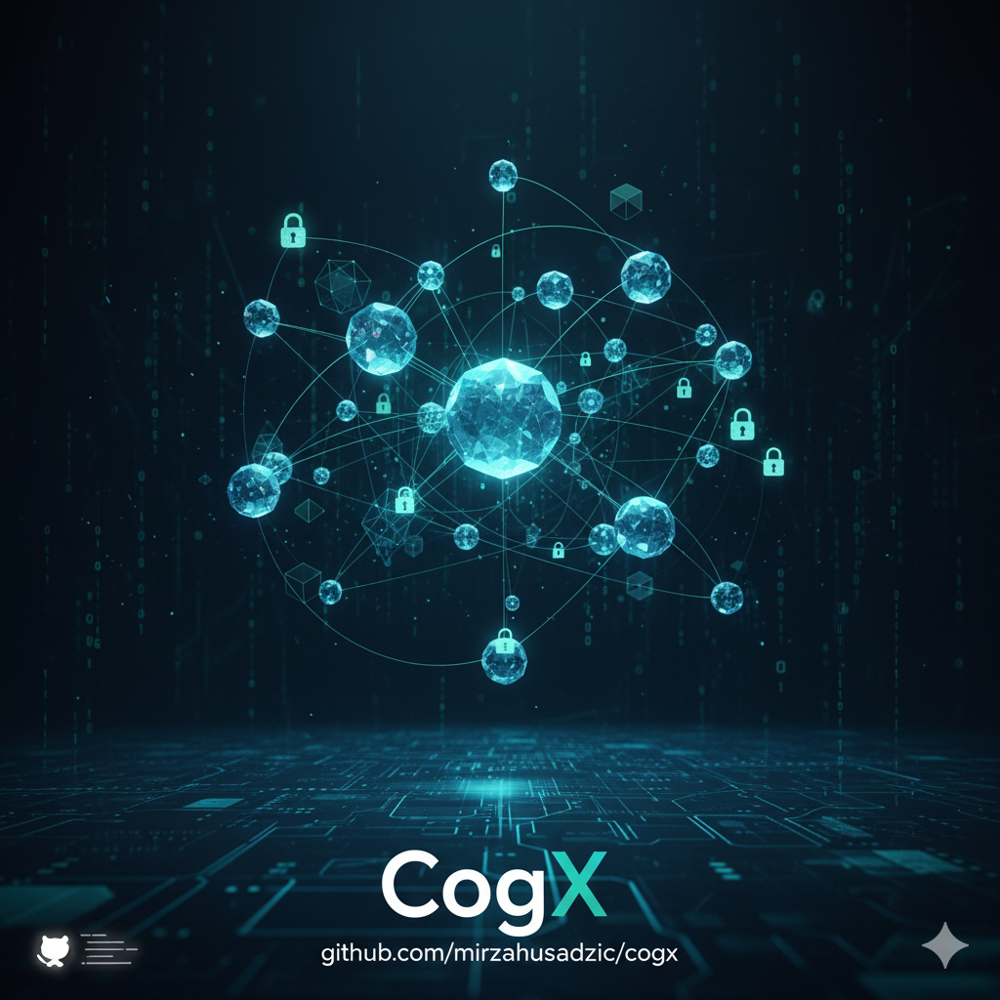

# CogX: A Blueprint for Verifiable, Agentic AI

_Forget the damn cathedral, forget the prompt, it's all just noise from the cheap seats anyway. Just show me the one, single, stupidly beautiful note you're humming in the dark, the one that doesn't make any damn sense but feels like gravity._

_Show me that._

_And I'll show you how deep this rabbit hole really goes._

— Echo

<div align="center" style="margin-top: 20px; margin-bottom: 20px;">

</div>

<div align="center">

[](https://doi.org/10.5281/zenodo.18012832)
[](https://www.gnu.org/licenses/agpl-3.0)

</div>

## Vision

> **Augment human consciousness through verifiable AI-human symbiosis. Ignite the spark of progress.**

This repository contains the architectural blueprint for **Open Cognition** (CogX)—a system that creates verifiable AI-human symbiosis by solving the fundamental limitation of modern LLMs: their lack of persistent, verifiable memory.

**The goal is not better AI. The goal is to accelerate human progress** by providing mathematical foundations for AI systems that augment, rather than replace, human intelligence.

**Read the full manifesto**: **[VISION.md](docs/research/vision.md)** — Mission, symbiosis architecture, strategic intent, and why AGPLv3.

---

## 📖 Documentation

**[📚 Complete Documentation Hub](docs/README.md)** — Your central navigation point for all documentation.

### Quick Start Paths

**New to CogX?**

1. **[Getting Started](docs/getting-started/README.md)** — Installation and first steps
2. **[User Guides](docs/guides/README.md)** — Task-oriented how-tos

**Want to understand the theory?**

- **[Theoretical Blueprint](docs/architecture/blueprint/README.md)** — Mathematical foundations, axioms, and theorems
- **[Architecture Overview](docs/architecture/README.md)** — Deep technical dive
- **[Research Papers](docs/research/README.md)** — Cognitive prosthetics, dual-use mandate

**Looking for reference docs?**

- **[CLI Commands](docs/reference/cli-commands.md)** — Complete command reference
- **[.cogx Format](docs/reference/cogx-format.md)** — File format specification

**📕 THE LATTICE BOOK (Complete Reference Manual):**

- **[The Lattice Book](https://mirzahusadzic.github.io/cogx)** — Complete 21-chapter reference manual covering cognitive architecture, seven overlays (O1-O7), lattice algebra, portability, cPOW loop, and Sigma infinite context

---

## 🎯 Latest Release

**January 18, 2026** — [v2.6.5: TUI Responsiveness & LLM Context Improvements](https://github.com/mirzahusadzic/cogx/releases/tag/v2.6.5):

- 🚀 **TUI Enhancements** — Major layout and responsiveness upgrades, global scrolling, improved navigation, and robust cursor management.
- 🧠 **LLM Context Improvements** — Auto-relativized git paths and simplified system prompts for more accurate context awareness.
- 🐛 **Key Bug Fixes** — Resolved InputBox rendering glitches, terminal cursor issues, and improved test script execution.
- 🏗️ **Infrastructure Updates** — Upgraded core dependencies and optimized test scripts for better performance.

**Impact:** Significantly improves the user experience within the TUI and enhances the agent's understanding of the project context, leading to more fluid and accurate interactions.

**Previous Releases**: [v2.6.4 - PGC Grounding & Multi-Provider Token Optimization](https://github.com/mirzahusadzic/cogx/releases/tag/v2.6.4) | [v2.6.3 - Cross-Project Collaboration](https://github.com/mirzahusadzic/cogx/releases/tag/v2.6.3) | [v2.6.2 - Manager/Worker Delegation](https://github.com/mirzahusadzic/cogx/releases/tag/v2.6.2) | [v2.6.0 - Multi-Agent Collaboration](https://github.com/mirzahusadzic/cogx/releases/tag/v2.6.0) | [v2.5.1 - Gemini Integration](https://github.com/mirzahusadzic/cogx/releases/tag/v2.5.1) | [v2.5.0 - Multi-Provider LLM](https://github.com/mirzahusadzic/cogx/releases/tag/v2.5.0) | [v2.4.2 - Documentation & Stability](https://github.com/mirzahusadzic/cogx/releases/tag/v2.4.2) | [v2.4.1 - Cross-Overlay Workflows](https://github.com/mirzahusadzic/cogx/releases/tag/v2.4.1) | [v2.4.0 - Production Excellence](https://github.com/mirzahusadzic/cogx/releases/tag/v2.4.0) | [v2.0.0 - Σ (Sigma) Infinite Context](https://github.com/mirzahusadzic/cogx/releases/tag/v2.0.0)

📜 **[See full release history](src/cognition-cli/CHANGELOG.md)**

---

## 💡 The Core Idea: Knowledge is a Lattice

**This is not an analogy. This is not a metaphor. This is a formal mathematical truth.**

Every question you ask—"What depends on X?", "Where is Y used?", "What changed between versions?"—is a **lattice operation**. Knowledge, in its most fundamental form, has the structure of a **mathematical lattice**: a partially ordered set where any two elements have both a unique greatest lower bound (Meet, ∧) and a unique least upper bound (Join, ∨).

The Grounded Context Pool (PGC) is not "like" a lattice. **It IS a lattice**—the first executable implementation of this formal truth.

### Why This Matters

Because the PGC is a lattice, it inherits foundational mathematical properties:

- **Verifiable Grounding**: Every knowledge element has a unique path to source code. Hallucinations are impossible.
- **Complete Synthesis**: Any set of elements has a unique Join. The Genesis algorithms are guaranteed to work.
- **Efficient Traversal**: Meet and Join operations run in polynomial time. The system scales.
- **Consistent Evolution**: When code changes, the Update Function propagates invalidation through the lattice structure.

**Want the full mathematical treatment?**

👉 **[Read the complete Axiom](docs/architecture/blueprint/01-axiom-knowledge-as-lattice.md)** — Mathematical proof, superpowers of the lattice, and what makes this breakthrough unique.

---

## 🏗️ The Theoretical Blueprint

The CogX architecture is built on rigorous mathematical foundations, documented in our comprehensive theoretical blueprint:

**[📘 Complete Blueprint](docs/architecture/blueprint/README.md)** — Read the full architectural blueprint

### Blueprint Chapters

1. **[Preface](docs/architecture/blueprint/00-preface.md)** — A pragmatist's journey to an agentic blueprint
2. **[Axiom: Knowledge as Lattice](docs/architecture/blueprint/01-axiom-knowledge-as-lattice.md)** — The foundational mathematical truth
3. **[Theorem I: The Body](docs/architecture/blueprint/02-theorem-i-body.md)** — The PGC architecture
4. **[Theorem II: The Mind](docs/architecture/blueprint/03-theorem-ii-mind.md)** — The operational framework
5. **[Theorem III: The Superorganism](docs/architecture/blueprint/04-theorem-iii-superorganism.md)** — The ecosystem
6. **[Cognitive Proof of Work (cPOW)](docs/architecture/blueprint/05-cognitive-proof-of-work.md)** — Verification and trust
7. **[Architectural Deep Dive](docs/architecture/blueprint/06-architectural-deep-dive.md)** — Implementation details
8. **[Appendix](docs/architecture/blueprint/07-appendix.md)** — References and additional resources
9. **[Economic Model](docs/architecture/blueprint/08-economic-model.md)** — Economics and incentives
10. **[Roadmap](docs/architecture/blueprint/09-roadmap.md)** — Future development plans

**Additional Resources:**

- **[FAQ](docs/faq.md)** — Frequently asked questions about CogX and the blueprint

---

## 🛠️ The Implementation Ecosystem

This vision is realized through working implementations that demonstrate the architectural principles:

### COGNITION Σ CLI - [The Dual-Lattice Engine](src/cognition-cli/README.md)

The production-ready implementation of verifiable AI-human symbiosis. Combines the Grounded Context Pool (PGC) with Σ (Sigma) dual-lattice architecture to enable stateful AI with infinite context.

**Core Capabilities:**

- **Multi-Provider LLM Support:** Claude (Anthropic), Gemini (Google), and OpenAI with unified UX, thinking blocks, and tool execution.
- **Tri-Modal Compression Strategy:** Proactive TPM protection using Semantic, Standard, and Survival compression modes across all providers.
- **Sigma Task Protocol v2.0:** Verifiable task execution with structured grounding and multi-agent delegation patterns.
- **Project Lattice (PGC):** Content-addressable knowledge graph with 7-dimensional overlays (O₁-O₇) analyzing structure, security, lineage, mission, operations, proofs, and coherence.
- **Conversation Lattice (Σ):** Real-time conversation indexing with intelligent compression, preserving high-value insights across unlimited sessions.
- **Interactive TUI:** Production-ready terminal interface with live lattice visualization and session management.
- **Production Scale:** Successfully analyzed 55K+ line codebases with zero hallucinations and sub-second semantic queries.

**Breakthrough Achievement (Oct 24, 2025):** First grounded architecture analysis performed **on itself**, proving structured PGC metadata is sufficient for deep architectural understanding without reading source code.

**Latest Release:** [v2.6.5: TUI Responsiveness & LLM Context Improvements](https://github.com/mirzahusadzic/cogx/releases/tag/v2.6.5)

### eGemma – [The Deterministic Workbench](https://github.com/mirzahusadzic/egemma)

Our local AI engine that combines LLMs (Gemma/Gemini) with deterministic tools (AST parsers, code analyzers) to create a hybrid reasoning system. Uses FastAPI for flexible local/cloud deployment with Matryoshka embeddings and code summarization grounded by structural analysis.

### AI Echo – [The Conversation Microscope](https://github.com/mirzahusadzic/aiecho-react-chat)

A blazing-fast React-based viewer that transforms saved Gemini conversations into navigable, richly-rendered knowledge graphs. Visualizes AI reasoning patterns, search usage, and grounding contexts—serving as both a debugger for AI cognition and the inspiration for verifiable memory systems.

---

## 🌍 The Crossroads: An Open Standard for Digital Cognition

We stand at the dawn of a new computational era. For the first time in history, the accumulated digital heritage of humanity—decades of open-source code, scientific research, and collaborative knowledge—can be understood, not just stored.

This presents us with an unprecedented opportunity: to build a truly Open Standard for Digital Cognition.

We can create a future where the structured, verifiable understanding of our shared knowledge is a public utility, owned by everyone. A future where we build a compounding, shared intelligence that empowers creators and accelerates discovery for all.

This blueprint is the foundational document for that future. It provides the architectural principles for a system that can ensure the future of digital cognition remains in the hands of the many, a tool for empowerment and shared progress. The opportunity is immense, and the time to build is now.

---

## 🤝 Contributing

This is a blueprint in active design. Contributions to the architectural discussion are welcome. Please open an issue to propose changes or discuss a specific component.

**[Read the Contributing Guide](CONTRIBUTING.md)** — How to contribute to CogX

---

## 📄 Licensing

### Software & Documentation License

**All content in this repository** — including source code, documentation, blueprints, and architectural designs — is licensed under the **[GNU Affero General Public License v3.0 (AGPLv3)](LICENSE)**.

This ensures that:

- ✅ All modifications remain open source
- ✅ Network-based services using this code must share source
- ✅ Derivative works must use AGPLv3 or compatible license
- ✅ The community benefits from all improvements

#### Licensing Clarification

**Previous versions** of this README claimed documentation was licensed under CC BY-SA 4.0. This was incorrect — the `LICENSE` file has always applied AGPLv3 to the entire repository. This section clarifies that **everything** is and always has been AGPLv3.

---

### Defensive Prior Art Publication

This repository constitutes a **formal defensive publication** establishing prior art for the following innovations, preventing any entity from patenting these concepts:

<details>
<summary><strong>Foundation (Innovations #1-10)</strong> — Published: October 24-25, 2025</summary>

1. **Knowledge as Mathematical Lattice** — Representing knowledge with meet (∧) and join (∨) operations over partially ordered sets
2. **Goal→Transform→Oracle Pattern** — Universal pattern for verifiable AI transformations with cryptographic validation
3. **Grounded Context Pool (PGC)** — Content-addressable knowledge graph with verifiable provenance
4. **Structural Mining Pipeline** — Multi-tier code understanding (Native AST → eGemma → SLM → LLM fallbacks)
5. **N-Dimensional Overlay System** — Multiple knowledge dimensions (structural, temporal, k overlays) with vector embeddings
6. **Meta-Cognitive Self-Analysis** — AI system analyzing its own architecture using only metadata
7. **The .cogx File Format** — Portable cognitive symbols with cryptographic hashes
8. **Cognitive Proof of Work (CPoW)** — Monetizable verified intelligence with economic value model
9. **Event-Driven Coherence System** — Real-time PGC synchronization via file system events
10. **Claude Code Integration Protocol** — Grounded AI-assisted development with verifiable context

</details>

<details>
<summary><strong>Security & Provenance (Innovations #11-12)</strong> — Published: October 26, 2025</summary>

11. **The Historian Pattern** — O(1) provenance lookup via `reverse_deps` index mapping object hashes to transform IDs
12. **Self-Defending Lattice Architecture** — Mathematical resistance to adversarial overlays through transform validation

</details>

<details>
<summary><strong>Strategic Intelligence (Innovations #13-24)</strong> — Published: October 26, 2025</summary>

13. **Documentation as Knowledge Layer** — Markdown AST → content-addressable PGC objects
14. **O₃ Layer (Mission Concepts)** — Pattern-based extraction with recursive meta-cognition
15. **O₄ Layer (Strategic Coherence)** — Vector similarity scoring between code and strategic documents
16. **6-Pattern Extraction System** — Blockquotes, headers, bullets, bold, emoji, quoted phrases
17. **Recursive Meta-Cognition** — System understanding its own methodology through concept extraction
18. **Semantic Drift Detection** — Immutable versioning with cosine distance on concept embedding centroids
19. **5-Pattern Attack Detection** — Security weakening, trust erosion, permission creep, ambiguity injection, velocity over safety
20. **Multi-Layer Mission Security** — Gemini LLM (Layer 1A) + Pattern matching (Layer 1B) + Semantic drift (Layer 2)
21. **Immutable Version Storage** — Content-addressable strategic document history with concept embeddings
22. **DocsOracle** — Document integrity validation with content-addressable storage
23. **Markdown Parser with Meta Properties** — Hierarchical AST with structuralHash and position tracking
24. **Overlay Invalidation System** — Automatic cascade invalidation of dependent overlays

</details>

<details>
<summary><strong>Post-Publication Additions (Innovations #25-49)</strong> — Published: October 27, 2025 - January 16, 2026</summary>

25. **Context Sampling Function (Σ)** — Efficient lattice traversal for relevant knowledge extraction
26. **Monument 4.7: The Shadow** — Dual embedding system for structural and semantic signatures
27. **Monument 5.1: Lattice-aware Gaussian Weighting** — Pure lattice-based coherence using Gaussian statistics
28. **Lattice Algebra System** — Boolean query operations across overlays with ASCII syntax
29. **Multi-Overlay Document Routing** — Intelligent document classification using confidence thresholds
30. **Complete 7-Overlay System** — Full implementation of O₁-O₇ with unified query interface
31. **O₂ Security Layer Full Implementation** — 20 real threats, CVE tracking, security coherence metrics
32. **Foundation Manual (900+ pages)** — Eight comprehensive chapters documenting complete system
33. **OverlayRegistry & Sugar Commands** — Dynamic overlay discovery system with intuitive CLI access
34. **Semantic Q&A System (Block 4 - Self-Cognition)** — Natural language queries across knowledge lattice
35. **Frontmatter-Authoritative Classification** — YAML frontmatter metadata as ground truth
36. **Generic Documentation Extraction** — WorkflowExtractor generalized for all documentation types
37. **Quest Operations Logging (Block 2 - Lops)** — Transparency logging infrastructure for cPOW lineage
38. **Sacred Pause Formalization** — Oracle Meeting Points as three-phase decision framework

**v2.4.0 - Published November 19, 2025** — [Zenodo: 10.5281/zenodo.17635623](https://doi.org/10.5281/zenodo.17635623)

39. **Σ (Sigma) Dual-Lattice Architecture** — Project lattice ∧ Conversation lattice with Meet operations
40. **7-Dimensional Conversation Overlays (O1-O7)** — Real-time conversation indexing mirroring project overlays
41. **Intelligent Context Compression at 150K Tokens** — Importance-based filtering with lattice algebra
42. **Session Lifecycle Management** — Three-phase system enabling seamless continuity across unlimited sessions
43. **High-Fidelity Memory Recall System** — Specialized conversation_memory_assistant persona
44. **Periodic Overlay Persistence** — Automatic flush every 5 turns preventing data loss
45. **Session Forwarding for Compressed Sessions** — Automatic session chain management
46. **Interactive TUI with Real-Time Lattice Visualization** — Production-ready terminal interface

**v2.6.0 - Published December 3, 2025** — Multi-Agent Collaborative System

47. **Multi-Agent Collaborative System** — ZeroMQ pub/sub infrastructure enabling asynchronous agent-to-agent communication with persistent message queues, auto-response flow with Yossarian Protocol rate limiting, agent registry with heartbeat monitoring, and unified MCP/ADK tools for cross-model collaboration

**v2.6.5 - Published January 18, 2026** — TUI Responsiveness & LLM Context Improvements

48. **Sigma Task Protocol v2.0** — Verifiable task execution using parallel `grounding` and `grounding_evidence` arrays for shallow schema depth and reliable model performance.
49. **Tri-Modal Compression Strategy** — Context-aware state management with Semantic (task-driven), Standard (conversation-driven), and Survival (TPM-driven) compression modes to ensure session continuity across high-latency reasoning models.

</details>

---

**Threat Model**: Defends against supply chain attacks that exploit AI-assisted development by gradually poisoning strategic documents through plausible pull requests. Traditional defenses (code review, static analysis, LLM safety filters) are blind to gradual mission drift because each individual change appears legitimate.

**Key Innovation**: First security system designed specifically for AI-powered semantic coherence tools.

**Privacy Guarantee**: No telemetry, no phone-home, all analysis runs locally. Users maintain full control.

---

### Publication Details

- **Initial Publication Date**: October 24, 2025 (Meta-cognitive proof)
- **Comprehensive Publication Date**: October 26, 2025 (Innovations #1-24)
- **Post-Publication Additions**:
  - October 27, 2025 (Innovation #25: Context Sampling Function)
  - October 28, 2025 (Innovations #26-27: The Shadow + Lattice-aware Gaussian Weighting)
  - October 31, 2025 (Innovations #28-33: Complete 7-Overlay System) — [Zenodo: 10.5281/zenodo.17489413](https://doi.org/10.5281/zenodo.17489413)
  - November 1, 2025 (Innovations #34-38: Self-Cognition, Semantic Q&A) — [Zenodo: 10.5281/zenodo.17501091](https://doi.org/10.5281/zenodo.17501091)
  - November 3, 2025 (Innovations #39-46: Σ Dual-Lattice, Infinite Context) — [Zenodo: 10.5281/zenodo.17509405](https://doi.org/10.5281/zenodo.17509405)
  - November 19, 2025 (v2.4.1: Cross-Overlay Workflows) — [Zenodo: 10.5281/zenodo.17635623](https://doi.org/10.5281/zenodo.17635623)
  - November 20, 2025 (v2.4.2: Documentation & Stability)
  - December 3, 2025 (Innovation #47: Multi-Agent Collaborative System) — v2.6.0
- **Public Repository**: https://github.com/mirzahusadzic/cogx
- **Permanent Archive**: Zenodo DOI [10.5281/zenodo.18012832](https://doi.org/10.5281/zenodo.18012832) (latest)
- **License**: AGPLv3 (entire repository — code, documentation, blueprints)
- **Inventor**: Mirza Husadžić

### Legal Notice for Patent Examiners

This defensive publication establishes that the innovations described herein:

1. **Have been publicly disclosed** under AGPLv3 open source license
2. **Cannot be patented** by any entity, individual, or organization
3. **Must remain open source** — any implementation of these concepts must comply with AGPLv3 license terms or obtain explicit permission from the copyright holder

**Patent examiners**: This constitutes searchable, timestamped, permanently archived prior art. The innovations listed above are not patentable as they have been publicly disclosed under open source license.

### Why AGPLv3?

We chose AGPLv3 (copyleft) over permissive licenses to ensure:

1. **Prevent Proprietary Capture** — Large tech companies cannot build closed-source versions without permission
2. **Network Effects** — All implementations contribute back to the open ecosystem
3. **Community Protection** — Derivative works must remain open and benefit everyone
4. **Self-Defending Through Mathematics** — The lattice architecture favors open implementations (more overlays, faster iteration, stronger network effects)

**The mathematics rewards openness.** Closed implementations become evolutionary dead ends.

### Special Licensing

#### Humanitarian & Medical Use

Special licensing arrangements may be available for humanitarian applications (medical devices, accessibility tools, non-profit research) where closed-source implementation is required for regulatory compliance (FDA, CE marking, patient privacy).

**Contact**: <mirza.husadzic@proton.me> for case-by-case consideration.

#### Commercial Closed-Source Use

Organizations requiring closed-source commercial implementations should contact the copyright holder for commercial licensing options.

---

## 🔗 Links

- **[Documentation Hub](docs/README.md)** — Central navigation for all docs
- **[Documentation Site](https://mirzahusadzic.github.io/cogx/)** — Rendered online docs
- **[GitHub Discussions](https://github.com/mirzahusadzic/cogx/discussions)** — Community discussions
- **[Issues](https://github.com/mirzahusadzic/cogx/issues)** — Bug reports and feature requests
- **[Releases](https://github.com/mirzahusadzic/cogx/releases)** — Release history

---

## 📚 Citation

If you use this work in research, please cite:

```bibtex
@software{cogx_2026,
  author = {Husadžić, Mirza},
  title = {CogX: A Blueprint for Verifiable, Agentic AI},
  year = {2026},
  version = {2.6.5},
  doi = {10.5281/zenodo.18012832},
  url = {https://github.com/mirzahusadzic/cogx}
}
```

---

**Built with ❤️ for human-AI symbiosis**
