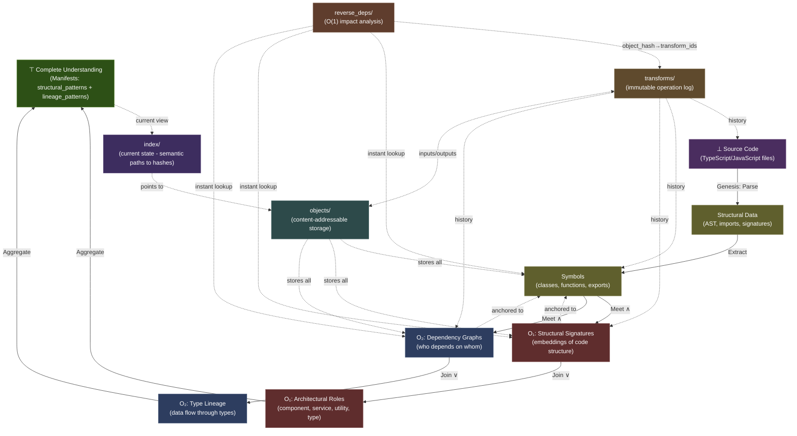

# The Axiom: Knowledge is a Lattice

**This is not an analogy. This is not a metaphor. This is a formal mathematical truth.**

Every question you ask—"What depends on X?", "Where is Y used?", "What changed between versions?"—is a **lattice operation**. Knowledge, in its most fundamental form, has the structure of a **mathematical lattice**: a partially ordered set where any two elements have both a unique greatest lower bound (Meet, ∧) and a unique least upper bound (Join, ∨).

The Grounded Context Pool (PGC) is not "like" a lattice. **It IS a lattice**—the first executable implementation of this formal truth.

## The Two Fundamental Operations

Every act of reasoning reduces to two primitive operations:

### **Meet (∧): Finding Common Ground**

The Meet operation answers: _"What do these two things share?"_

```text
Component_A ∧ Component_B → Common_Dependencies
```

- **In the PGC:** When you query "What do UserService and OrderService depend on?", you're computing the Meet—traversing down the dependency graph to find the shared ancestors (DatabaseClient, Logger, etc.).
- **The Result:** The greatest lower bound—the deepest shared foundation.
- **Why It's Universal:** Every "find common dependencies" query, every "what's the shared interface" question, every "trace back to the root cause" analysis is a Meet operation.

### **Join (∨): Building Higher Understanding**

The Join operation answers: _"What's the smallest thing that contains both?"_

```text
File_A ∨ File_B → Synthesized_Component_Summary
```

- **In the PGC:** When the Genesis algorithm creates a directory summary from two file summaries, it's computing the Join—synthesizing a higher-level abstraction that contains both.
- **The Result:** The least upper bound—the smallest complete picture.
- **Why It's Universal:** Every "summarize these modules" task, every "what system contains both features" question, every "abstract to the next level" operation is a Join operation.

### **The Update Function (U): The Lattice in Motion**

When source code changes, the Update Function (U) is the recursive loop that keeps the lattice coherent:

```text
Change(⊥) → Invalidate(⊥) → Propagate_Up(Join_edges) → Invalidate(⊤)
```

- **The Input:** A `change_event` at the bottom (⊥)—raw source code modified
- **The Traversal:** U follows the lattice structure upward, using `reverse_deps` to find all Join operations that consumed the changed element
- **The Propagation:** Each dependent knowledge element is marked `Invalidated`, and U recursively continues upward through their consumers
- **The Result:** A wave of invalidation flows from ⊥ to ⊤, marking exactly what needs regeneration

**Why it's a lattice operation:** The Update Function computes the **upward closure** of a changed element—the set of all elements reachable by following Join edges. This is only efficient because the lattice structure provides unique paths and O(1) reverse lookups via `reverse_deps`.

**Without the lattice:** You'd need to scan the entire knowledge base. **With the lattice:** You follow the structure, propagating change in polynomial time.

## The PGC: An Executable Theory of Knowledge

The PGC architecture is a **constructive proof** that knowledge forms a lattice:

### Figure 1: The N-Dimensional Lattice Architecture



**Legend:**

- **Solid arrows (→)**: Lattice operations (Meet ∧ and Join ∨) - the vertical structure
- **Dashed arrows (-.->)**: Infrastructure connections - storage, indexing, and history
- **Bidirectional (←→)**: Mutual reference relationships

### Data Flow Patterns

The diagram illustrates five critical data flow patterns:

**1. Genesis Flow (Bottom → Up):**

```text
SOURCE → STRUCTURE → SYMBOLS → O₁/O₂ → TOP
```

The foundational extraction: raw source code is parsed into structural data, symbols are extracted, overlays analyze them, all aggregating to complete understanding (⊤).

**2. The Historian Pattern (Object → Transform → History):**

```text
object_hash → REVERSE[object_hash→transform_ids] → TRANSFORMS[inputs/outputs] → OBJECTS
```

**O(1) time travel:** Given any object hash, instantly retrieve which transform created it and trace back to original inputs. This is the bidirectional bridge that enables verifiable provenance.

**3. Storage & Retrieval (Index → Objects):**

```text
INDEX[semantic_path→hash] → OBJECTS[hash→data]
```

The conscious mind: human-readable paths map to content-addressable storage. The present state of knowledge.

**4. Update Function (Change Propagation):**

```text
SOURCE (changed) → REVERSE[instant lookup] → SYMBOLS → O₁/O₂ (invalidated)
```

When source code changes at ⊥, `reverse_deps` provides O(1) lookup of all dependent transforms, propagating invalidation upward through the lattice.

**5. Overlay Anchoring (Horizontal Dimension):**

```text
SYMBOLS ←--anchored to--→ O₁ (Structural Patterns)
SYMBOLS ←--anchored to--→ O₂ (Lineage Patterns)
```

Multiple overlays anchor to the same Genesis Layer truth, forming independent horizontal lattices that aggregate to ⊤.

---

**The Four Pillars of the PGC (The "Digital Brain"):**

1. **`objects/` - The Immutable Memory:** Content-addressable storage where every unique piece of knowledge lives exactly once, named by its cryptographic hash. This is the bedrock—data integrity guaranteed by mathematics.

2. **`index/` - The Conscious Mind (The Present):** The mutable "Table of Contents" that maps human-readable semantic paths to their current, valid content hashes in `objects/`. **This IS the true present state**—the system's current understanding of reality. When you query the PGC, you're reading the `index/`.

3. **`transforms/` - The Auditable Thought Process (The Past):** The immutable Operations Log (Lops). Every transformation—every "thought" the system has ever had—is recorded here as a verifiable receipt linking input hashes to output hashes. This makes the entire reasoning process transparent and reconstructible. **This is the temporal dimension** of the lattice.

4. **`reverse_deps/` - The Reflexive Nervous System (The Reaction):** The high-speed index that enables O(1) reverse lookups: "What depends on this hash?" This is what makes the Update Function (U) viable at scale—when source code changes at ⊥, the system instantly knows what needs invalidation by traversing upward through the lattice via `reverse_deps/`.

**The Lattice Structure:**

Every knowledge element has:

- **A position in the lattice** - Its abstraction level (from ⊥ source code to ⊤ complete understanding)
- **Downward edges (Meet ∧)** - What it's grounded in (tracing back to source truth)
- **Upward edges (Join ∨)** - What it synthesizes into (building higher abstractions)
- **Horizontal edges** - How overlays anchor to the Genesis Layer (the N dimensions)
- **Historical edges** - How it evolved through `transforms/` (the temporal dimension)
- **Reflexive edges** - What depends on it via `reverse_deps/` (enabling Update Function U)

**The Overlays: Sensory Organs of the System**

The diagram shows two operational overlays—these are the system's **"sensory organs"** that provide specialized, analytical views of the Genesis Layer without polluting the foundational truth:

- **`structural_patterns/` (Red) - The Architectural Eye:** This overlay anchors to Genesis symbols and extracts their structural signatures via embeddings. It then classifies these into architectural roles (component, service, utility, type). When you run `cognition-cli patterns analyze`, you're querying this overlay's synthesized understanding. **This is how the system "sees" architecture.**

- **`lineage_patterns/` (Blue) - The Dependency Sense:** This overlay anchors to the same Genesis symbols but traces dependency relationships and type lineage. It builds the "who depends on whom" graph. When you run `cognition-cli blast-radius`, you're asking this overlay to compute impact. **This is how the system "feels" connections.**

**Key insight:** Both overlays anchor to the same Genesis Layer (the shared ground truth at ⊥), but they form their own **horizontal lattices** with their own Join operations:

- Structural signatures (Meet from symbols) → Architectural roles (Join into classification)
- Dependency graphs (Meet from symbols) → Type lineage (Join into flow analysis)

Both then aggregate upward to ⊤ (Complete Understanding). This is the **N-dimensional lattice**: N = 1 (structural) + 1 (temporal) + k (overlays). Currently k=2 (structural_patterns, lineage_patterns), but the architecture supports arbitrary specialized overlays (security, performance, business logic, etc.).

**The `index/` is the present. The `objects/` are eternal. The `transforms/` are the past. The `reverse_deps/` are the nervous system that propagates change. The overlays are the sensory organs that perceive specialized truths.**

This is not how we **chose** to organize knowledge. This is how knowledge **must** be organized to remain coherent, verifiable, and reactive.

## Mathematical Proof: The PGC is a Lattice

**Theorem:** The Grounded Context Pool (PGC) forms a bounded lattice (L, ≤, ∧, ∨, ⊥, ⊤).

**Proof:**

1. **Partial Order (≤):** Define x ≤ y as "knowledge element x is used in the creation of knowledge element y" (the dependency relation). This is:
   - Reflexive: Every element depends on itself (x ≤ x)
   - Antisymmetric: If x ≤ y and y ≤ x, then x = y (no circular dependencies due to content-addressable hashing)
   - Transitive: If x ≤ y and y ≤ z, then x ≤ z (dependency chains are transitive)

2. **Meet Operation (∧):** For any two elements x and y, their Meet x ∧ y is the set of common dependencies found by traversing down the reverse dependency graph. This is the greatest lower bound because:
   - It's a lower bound: All common dependencies are below both x and y
   - It's the greatest: No higher element is below both (due to content-addressability—two identical dependencies have the same hash)

3. **Join Operation (∨):** For any two elements x and y, their Join x ∨ y is the synthesized summary created by the Genesis algorithms. This is the least upper bound because:
   - It's an upper bound: The synthesis contains both x and y
   - It's the least: It's the minimal synthesis (determined by the Bottom-Up Aggregation algorithm that creates the smallest containing summary)

4. **Bounds:** The lattice has:
   - Bottom (⊥): The raw source code (Draw)—all knowledge is grounded here
   - Top (⊤): The complete project understanding—the root repository summary that contains all knowledge

Therefore, (PGC, ≤, ∧, ∨, ⊥, ⊤) satisfies all lattice axioms. **Q.E.D.**

## The Superpowers of the Lattice

Because the PGC is a lattice, it inherits four foundational laws:

### 1. **The Law of Verifiable Grounding**

Every knowledge element has a unique path to the bottom (⊥). You can always trace any claim back to its source code origin. **This is why hallucinations are impossible**—every node must have downward edges to ⊥.

### 2. **The Law of Complete Synthesis**

Every set of elements has a unique Join. You can always compose a coherent summary from any collection of knowledge. **This is why the Genesis algorithms work**—the lattice structure guarantees a minimal synthesis exists.

### 3. **The Law of Efficient Traversal**

Meet and Join operations are computable in polynomial time via graph traversal. **This is why the Context Sampling Function (Σ) scales**—you're not searching randomly, you're navigating a structured lattice.

### 4. **The Law of Consistent Evolution**

When source code changes, the Update Function (U) uses the lattice structure to propagate invalidation upward through Join edges. **This is why the system stays coherent**—the lattice topology ensures no orphaned or contradictory knowledge.

## What Was Known Before

The idea that knowledge has structure is ancient. What we **did** know:

- **Formal Concept Analysis (FCA):** Mathematics of concept lattices (Wille, 1982)
- **Ontologies & Taxonomies:** Hierarchical knowledge organization
- **Dependency Graphs:** Tools like npm, Maven showing package relationships
- **Git DAGs:** Content-addressable storage of code history
- **Epistemology:** Philosophical study of justified belief structures

These were all **glimpses** of the lattice, but incomplete.

## What Was NOT Known Before

**The profound "NO":** What was missing was the recognition that these are not separate ideas—they are facets of the **same underlying mathematical structure**. What the CogX blueprint contributes is:

1. **The Join-Construction:** Previous systems could traverse dependencies (Meet), but **none could automatically synthesize upward** (Join). The Genesis algorithms are the first verifiable implementation of Join-construction for code understanding—proving that Bottom-Up and Top-Down refinement are dual lattice operations.

2. **The N-Dimensional Living Lattice:** Traditional dependency graphs are static 2D snapshots. The PGC is a **dynamic, N-dimensional lattice structure** where N = 1 (structural) + 1 (temporal) + k (overlay dimensions):
   - **Structural lattice:** The core Meet/Join graph of code dependencies (⊥ to ⊤)
   - **Temporal lattice:** Historical edges through the `transforms/` log—the lattice evolves and remembers
   - **Overlay lattices:** Each overlay (security, performance, business logic) forms its own horizontal lattice anchored to the structural core

   **The breakthrough:** When source code changes at ⊥, the Update Function (U) propagates invalidation through a **dual-propagation model** across all N dimensions:
   - **Horizontal Shockwave (Bottom-Up):** Changes flow upward through the structural lattice (via Meet/Join edges), then horizontally into overlay lattices that depend on invalidated Genesis elements
   - **Upward Bias Cascade (Top-Down):** External insights in overlay lattices (e.g., CVE announcements) propagate inward to invalidate the Genesis Layer itself, then upward through the structural lattice

   This isn't theory—it's the operational implementation. See [Part VI: The Overlay System](../README.md#the-overlay-system-specialized-knowledge-and-external-insights) for the complete dual-propagation algorithms. The lattice structure is what makes both propagation models computationally tractable—they're traversing a mathematical structure with proven properties, not searching randomly.

3. **The Goal→Transform→Oracle Loop as Lattice Homomorphism:** The GTG loop isn't just a workflow—it's a **structure-preserving map** from the problem space lattice to the solution space lattice. Goals define positions in the lattice, Transforms compute Joins, Oracles verify the result is a valid upper bound. This is why the loop is universal—it's implementing fundamental lattice algebra.

4. **The Operational Proof:** The PGC is the first system to make the lattice **executable**. It's not a theoretical model—it's running code that proves knowledge must form a lattice by implementing that structure and demonstrating it works (October 24, 2025 validation).

**This is the deepest "aha!" of CogX:** The reason verifiable AI cognition is possible is not because we invented a clever architecture. **It's because knowledge is a lattice**, and lattices have unique, computable Meets and Joins. We simply aligned the implementation with the mathematics that was always true.

The PGC doesn't organize knowledge into a lattice. **It reveals that knowledge already is one.**

## What the Lattice Enables

Because knowledge is a lattice, we can:

- ✓ **Find true dependencies** with algorithmic certainty (not correlation—causation)
- ✓ **Synthesize new knowledge** through formal operations (not vibes)
- ✓ **Cache Derivations, Not Just Data:** The system remembers how knowledge was synthesized, so answering new questions becomes faster as the lattice grows
- ✓ **Reason symmetrically** (traverse both "what does this depend on?" and "what depends on this?" with equal efficiency)
- ✓ **Project Shapes Asymmetrically:** The human creator's superpower. Find a known pattern (a "shape") in the lattice and project it onto chaos to synthesize entirely new knowledge, which the symmetric system can then verify and integrate.

**The symmetric machine provides perfect traversal. The asymmetric human provides creative projection. This is the symbiosis.**
