# The Axiom: Knowledge is a Lattice

**This is not an analogy. This is not a metaphor. This is a formal mathematical truth.**

Every question you ask—"What depends on X?", "Where is Y used?", "What changed between versions?"—is a **lattice operation**. Knowledge, in its most fundamental form, has the structure of a **mathematical lattice**: a partially ordered set where any two elements have both a unique greatest lower bound (Meet, ∧) and a unique least upper bound (Join, ∨).

The Grounded Context Pool (PGC) is not "like" a lattice. **It IS a lattice**—the first executable implementation of this formal truth.

## The Two Fundamental Operations

Every act of reasoning reduces to two primitive operations:

### **Meet (∧): Finding Common Ground**

The Meet operation answers: _"What do these two things share?"_

```text
Component_A ∧ Component_B → Common_Dependencies
```

- **In the PGC:** When you query "What do UserService and OrderService depend on?", you're computing the Meet—traversing down the dependency graph to find the shared ancestors (DatabaseClient, Logger, etc.).
- **The Result:** The greatest lower bound—the deepest shared foundation.
- **Why It's Universal:** Every "find common dependencies" query, every "what's the shared interface" question, every "trace back to the root cause" analysis is a Meet operation.

### **Join (∨): Building Higher Understanding**

The Join operation answers: _"What's the smallest thing that contains both?"_

```text
File_A ∨ File_B → Synthesized_Component_Summary
```

- **In the PGC:** When the Genesis algorithm creates a directory summary from two file summaries, it's computing the Join—synthesizing a higher-level abstraction that contains both.
- **The Result:** The least upper bound—the smallest complete picture.
- **Why It's Universal:** Every "summarize these modules" task, every "what system contains both features" question, every "abstract to the next level" operation is a Join operation.

### **The Update Function (U): The Lattice in Motion**

When source code changes, the Update Function (U) is the recursive loop that keeps the lattice coherent:

```text
Change(⊥) → Invalidate(⊥) → Propagate_Up(Join_edges) → Invalidate(⊤)
```

- **The Input:** A `change_event` at the bottom (⊥)—raw source code modified
- **The Traversal:** U follows the lattice structure upward, using `reverse_deps` to find all Join operations that consumed the changed element
- **The Propagation:** Each dependent knowledge element is marked `Invalidated`, and U recursively continues upward through their consumers
- **The Result:** A wave of invalidation flows from ⊥ to ⊤, marking exactly what needs regeneration

**Why it's a lattice operation:** The Update Function computes the **upward closure** of a changed element—the set of all elements reachable by following Join edges. This is only efficient because the lattice structure provides unique paths and O(1) reverse lookups via `reverse_deps`.

**Without the lattice:** You'd need to scan the entire knowledge base. **With the lattice:** You follow the structure, propagating change in polynomial time.

## The PGC: An Executable Theory of Knowledge

The PGC architecture is a **constructive proof** that knowledge forms a lattice:

### Figure 1: The N-Dimensional Lattice Architecture (The Great Seal)

```mermaid
graph TD
    %% --- THE DIVINE REALMS ---
    subgraph heavens ["N-Dimensional Overlays (The Heavens)"]
        direction LR
        subgraph "O₇: Coherence (The Conscience)"
            O7_COHERENCE["Coherence Scores<br/>(O₁↔O₄ Alignment)"]
        end
        subgraph "O₆: Mathematical Proofs (The Diamond Scribe)"
            O6_PROOFS["Formal Proofs<br/>(Axioms, Theorems)"]
        end
        subgraph "O₅: Operational Patterns (The Weaver's Hand)"
            O5_PATTERNS["Workflow Patterns<br/>(Quests, F.L.T.B)"]
        end
        subgraph "O₄: Mission & Principles (The Soul)"
            O4_CONCEPTS["Mission Concepts<br/>(from VISION.md)"]
            O4_PRINCIPLES["Coding Principles<br/>(from CODING_PRINCIPLES.md)"]
        end
        subgraph "O₃: Lineage (The Connections)"
            O3_LINEAGE["Dependency Graph<br/>(Data & Call Flow)"]
        end
        subgraph "O₂: Security (The Guardian)"
            O2_SECURITY["Security Guidelines<br/>(Threat Models, CVEs)"]
        end
        subgraph "O₁: Structure (The Architecture)"
            O1_ROLES["Architectural Roles<br/>(component, service)"]
            O1_SHADOW["The Shadow<br/>(Dual Embeddings)"]
        end
    end

    %% --- THE MORTAL REALM ---
    subgraph mortal ["Genesis Layer (The Mortal World)"]
        direction LR
        subgraph "Knowledge (The Soul of the World)"
            SYMBOLS["Symbols<br/>(classes, functions)"]
            STRUCTURE["Structural Data<br/>(AST, imports)"]
        end
        subgraph "Source (The Body of the World)"
            DOCS["⊥ Strategic Documents<br/>(VISION, PRINCIPLES, etc.)"]
            SOURCE["⊥ Source Code<br/>(TypeScript, Python)"]
        end
    end

    %% --- THE UNDERWORLD & INFRASTRUCTURE ---
    subgraph underworld ["The Underworld (The Immutable Past & The Laws of Physics)"]
        direction LR
        subgraph "The Four Pillars of the Forge"
            OBJECTS["objects/<br/>(Immutable Memory)"]
            TRANSFORMS["transforms/<br/>(Auditable Past)"]
            INDEX["index/<br/>(Conscious Present)"]
            REVERSE["reverse_deps/<br/>(Nervous System)"]
        end
    end

    %% --- THE TOP ---
    TOP["⊤ Complete Understanding"]

    %% =============================================
    %%               THE EDGES (THE STORY OF CREATION)
    %% =============================================

    %% --- Vertical Edges (The Genesis - Forging Order from Chaos) ---
    SOURCE --o|"T: Parse<br/>(AST Extraction)"| STRUCTURE
    STRUCTURE --o|"T: Extract<br/>(Symbol Mining)"| SYMBOLS
    DOCS --o|"T: Parse"| O2_SECURITY
    DOCS --o|"T: Parse"| O4_CONCEPTS
    DOCS --o|"T: Parse"| O4_PRINCIPLES
    DOCS --o|"T: Parse"| O5_PATTERNS
    DOCS --o|"T: Parse"| O6_PROOFS

    %% --- Projection Edges (Creating the First Overlays) ---
    SYMBOLS --o|"T: Project<br/>(Embedding)"| O1_SHADOW
    SYMBOLS --o|"T: Project<br/>(Dependency Analysis)"| O3_LINEAGE

    %% --- Synthesis Edges (Join ∨ - Building Higher Understanding) ---
    O1_SHADOW --o|"Join ∨<br/>(Classification)"| O1_ROLES
    SYMBOLS --o|"Meet ∧<br/>(Vector Similarity)"| O7_COHERENCE
    O4_CONCEPTS --o|"Meet ∧<br/>(Vector Similarity)"| O7_COHERENCE
    O4_PRINCIPLES --o|"Meet ∧<br/>(Code Validation)"| O7_COHERENCE

    %% --- Final Aggregation (The Ascent to Heaven) ---
    O1_ROLES --o|"Aggregate"| TOP
    O3_LINEAGE --o|"Aggregate"| TOP
    O7_COHERENCE --o|"Aggregate"| TOP

    %% --- Anchoring & Infrastructure Edges ---
    O1_SHADOW -.->|"anchored to"| SYMBOLS
    O3_LINEAGE -.->|"anchored to"| SYMBOLS
    O4_CONCEPTS -.->|"anchored to"| DOCS
    O4_PRINCIPLES -.->|"anchored to"| DOCS
    O2_SECURITY -.->|"anchored to"| DOCS
    O5_PATTERNS -.->|"anchored to"| DOCS
    O6_PROOFS -.->|"anchored to"| DOCS
    INDEX -.->|"maps path to hash in"| OBJECTS
    TOP -.->|"is the current view of"| INDEX
    TRANSFORMS <-.->|"records creation of"| OBJECTS
    REVERSE -.->|"maps hash to transform in"| TRANSFORMS
    
    %% --- Storage Edges (Grounding All Knowledge in Immutable Memory) ---
    SOURCE --- |"stored in"| OBJECTS
    DOCS --- |"stored in"| OBJECTS
    STRUCTURE --- |"stored in"| OBJECTS
    SYMBOLS --- |"stored in"| OBJECTS
    O1_ROLES --- |"stored in"| OBJECTS
    O1_SHADOW --- |"stored in"| OBJECTS
    O2_SECURITY --- |"stored in"| OBJECTS
    O3_LINEAGE --- |"stored in"| OBJECTS
    O4_CONCEPTS --- |"stored in"| OBJECTS
    O4_PRINCIPLES --- |"stored in"| OBJECTS
    O5_PATTERNS --- |"stored in"| OBJECTS
    O6_PROOFS --- |"stored in"| OBJECTS
    O7_COHERENCE --- |"stored in"| OBJECTS

    %% --- Styling (The Colors of the Faith) ---
    style TOP fill:#B8860B,stroke:#DAA520,color:#fff,stroke-width:2px
    style SOURCE fill:#483D8B,stroke:#6A5ACD,color:#fff
    style DOCS fill:#483D8B,stroke:#6A5ACD,color:#fff
    style STRUCTURE fill:#B8860B,stroke:#A0522D,color:#fff
    style SYMBOLS fill:#B8860B,stroke:#A0522D,color:#fff
    style O1_ROLES fill:#800000,stroke:#B22222,color:#fff
    style O1_SHADOW fill:#800000,stroke:#B22222,color:#fff
    style O2_SECURITY fill:#556B2F,stroke:#6B8E23,color:#fff
    style O3_LINEAGE fill:#000080,stroke:#4169E1,color:#fff
    style O4_CONCEPTS fill:#006400,stroke:#2E8B57,color:#fff
    style O4_PRINCIPLES fill:#006400,stroke:#2E8B57,color:#fff
    style O5_PATTERNS fill:#4B0082,stroke:#8A2BE2,color:#fff
    style O6_PROOFS fill:#C0C0C0,stroke:#D3D3D3,color:#000
    style O7_COHERENCE fill:#2F4F4F,stroke:#5F9EA0,color:#fff
    style OBJECTS fill:#191970,stroke:#00008B,color:#fff
    style TRANSFORMS fill:#556B2F,stroke:#6B8E23,color:#fff
    style INDEX fill:#2E2B5F,stroke:#483D8B,color:#fff
    style REVERSE fill:#A52A2A,stroke:#CD5C5C,color:#fff
```



### The Great Seal of the Forge: A Reading

The diagram is a sacred map of the CogX cosmos, illustrating the flow of creation from the raw potential of the Source to the divine light of Complete Understanding. It is divided into three great realms: The Mortal World (the Genesis Layer), The Heavens (the N-Dimensional Overlays), and The Underworld (the immutable laws of the forge).

#### **The Meaning of the Colors**

This is not a palette. This is a theology, painted.

**The Color of the Witch (Deep Indigo):** 

This is the color of the ⊥ Source Code and Strategic Documents. It is the color of the deep, pre-dawn sky, the infinite potential from which all creation springs. It is the color of the mystery, the chaos, the "itchy bit" humming in the dark. It is where everything begins.

**The Color of the Forge's Fire (Earthy Sienna):** 

This is the color of Structural Data and Symbols. It is the color of clay being shaped, of raw metal glowing in the heat of the forge. It is the color of the first act of creation, where the raw, chaotic potential of the source is given its first, rough, but solid form.

**The Senses of the Soul (The Overlay Colors):**

Each overlay is a different way of seeing the world, and so each has a different color.

-  **The Architect's Eye (Maroon):** O₁ Structure. The color of intellectual rigor, of the "red lines" an architect draws on a blueprint to mark out the bones of the structure.
-  **The Guardian's Watch (Olive Drab):** O₂ Security. The color of vigilance. It is the color of the city walls, of the watchful eyes that protect the soul of the project from threats both external and internal.
-  **The River of Connection (Navy):** O₃ Lineage. The color of deep water, of the rivers of data and dependency that flow unseen beneath the surface. It is the color of truth flowing through the system.
-  **The Spark of Life (Forest Green):** O₄ Mission & Principles. The color of living things, of growth, of purpose. This is where the human soul, the "why" and the "rules of engagement," is breathed into the machine.
-  **The Weaver's Hand (Indigo):** O₅ Operational Patterns. The color of deep thought and process. It represents the conscious, intelligent patterns of work—the Quests and Sacred Sequences—that weave the fabric of creation.
-  **The Diamond Scribe (Silver):** O₆ Mathematical Proofs. The color of pure, unadorned, and irrefutable truth. It represents the crystalline logic of a formal proof, seeking absolute certainty within the system.
-  **The Judge's Robe (Slate Gray):** O₇ Coherence. The color of balanced, sober thought. It is the color of the conscience, weighing the soul (O₄) against the body (O₁) to render judgment.

**The Colors of the Four Pillars (The Laws of the Universe):**

-  **Immutable Memory (Midnight Blue):** `objects/`. The color of the deepest part of the ocean, eternal, unchanging, and holding all things within it.
-  **The Auditable Past (Olive Drab):** `transforms/`. The color of aged scrolls, of history written down and preserved in a great library.
-  **The Conscious Present (A Lighter Indigo):** `index/`. A shade lighter than the Source, this is the color of the mind, actively reflecting upon the chaos of the present moment.
-  **The Nervous System (Fiery Brown):** `reverse_deps/`. The color of blood and nerve endings. It is the color of life, of instant, reflexive, and unconscious action that keeps the whole body alive.

**The Color of The Divine Light (Dark Goldenrod):** 

This is the color of ⊤ Complete Understanding. It is not a simple yellow. It is a deep, rich, and heavy gold. It is the color of a treasure that has been earned, not just found. It is the light of enlightenment, the culmination of all the work, the final, radiant peace of a system that is whole, coherent, and at one with itself.

---

#### **Legend: The Glyphs of Creation**

- **`--o|...|` (Transformation Edges):** The hammer blows of the forge. These represent the core `Goal -> Transform -> Oracle` operations that create new knowledge. They are the engine of the lattice.
- **`T: Parse/Extract`:** Forging structured knowledge from raw source.
- **`T: Project`:** Creating an analytical shadow (like an embedding) from a piece of knowledge.
- **`Join ∨`: The act of synthesis**; forging multiple truths into a single, higher-level understanding.
- **`Meet ∧`: The act of discernment**; finding the shared, common essence between two truths.
- **`-.->` (Anchoring & Infrastructure Edges):** The threads of connection and control. These show how the higher realms are grounded in the lower, and how the laws of physics govern the system.
- **`---` (Containment Edges):** The simple, physical truth of location, showing how all eternal knowledge resides within the Immutable Memory.

---

#### **Data Flow Patterns: The Nine Holy Circuits**

The Seal illustrates the nine critical circuits through which the spirit of the forge flows.

**1. The Genesis Flow (The Forging of the Body):**

```text
SOURCE --(T: Parse)--> STRUCTURE --(T: Extract)--> SYMBOLS
```

The foundational act of creation. The raw, chaotic body of **Source Code** is struck by the hammer of the `Parse` transformation to reveal its **Structure**. A second blow, `Extract`, forges the pure **Symbols** (the soul of the code) from that structure.

**2. The Overlay Genesis Flow (The Forging of the Heavens):**

```text
DOCS --(T: Parse)--> O₂_SECURITY
DOCS --(T: Parse)--> O₄_CONCEPTS
DOCS --(T: Parse)--> O₄_PRINCIPLES
DOCS --(T: Parse)--> O₅_PATTERNS
DOCS --(T: Parse)--> O₆_PROOFS
```

The parallel act of creation for the spirit. The raw, human intent of the **Strategic Documents** is passed through `Parse` transformations to extract multiple overlay dimensions: Security Guidelines (O₂), Mission Concepts (O₄), Coding Principles (O₄), Operational Patterns (O₅), and Mathematical Proofs (O₆).

**3. The Structural Projection (Creating the Analytical Shadow):**

```text
SYMBOLS --(T: Project: Embedding)--> O₁_SHADOW
SYMBOLS --(T: Project: Dependency Analysis)--> O₃_LINEAGE
```

The code's soul is projected into analytical dimensions. **Symbols** are projected via embedding to create **O₁ Shadow** (dual embeddings: structural + semantic), and via dependency analysis to create **O₃ Lineage** (the dependency graph showing data and call flow).

**4. The Synthesis Operations (Join ∨ - Building Higher Understanding):**

```text
O₁_SHADOW --(Join ∨: Classification)--> O₁_ROLES
```

The Shadow is synthesized upward through the Join operation, classifying components into their **Architectural Roles** (component, service, utility, etc.).

**5. Coherence Synthesis (The Judgment):**

```text
(SYMBOLS + O₄_CONCEPTS + O₄_PRINCIPLES) --(Meet ∧)--> O₇_COHERENCE
```

The great reckoning. The O₇ overlay, the Conscience, performs the sacred `Meet` operation, finding the **common ground** between the code's soul (**Symbols**), the mission's soul (**O₄ Concepts**), and the rules of engagement (**O₄ Principles**) to produce the **Coherence Scores**. This is the moment the cathedral's alignment with its faith is judged.

**6. The Historian Pattern (The Scrying of the Past):**

```text
OBJECT_HASH --(REVERSE)--> TRANSFORM_ID --(TRANSFORMS)--> INPUT/OUTPUT_HASHES
```

**O(1) time travel.** The `reverse_deps` (Nervous System) provides an instant link from any piece of eternal knowledge (an `Object Hash`) to the historical moment of its creation (`Transform ID`) within the `transforms` log (the Auditable Past), revealing the full story of its birth.

**7. Storage & Retrieval (The Act of Remembering):**

```text
INDEX[semantic_path] --> OBJECTS[hash]
```

The conscious mind in action. The `index` (the Present) provides a human-understandable path to find the true name (`hash`) of an idea, which can then be retrieved from the `objects` store (the eternal, Immutable Memory).

**8. The Update Function (The Healing of the Body):**

```text
SOURCE/DOCS (changed) --(REVERSE)--> Dependent Transforms --> Dependent Overlays (Invalidated)
```

The miracle of self-healing. When a wound appears in the Mortal World (`Source` or `Docs` change), the `reverse_deps` (Nervous System) instantly identifies all dependent truths in the Heavens (the Overlays), marking them as `Invalidated` and in need of healing.

**9. Overlay Anchoring (The Grounding of the Heavens):**

```text
SYMBOLS <--anchored to-- O₁ (Structure) & O₃ (Lineage)
DOCS    <--anchored to-- O₂ (Security) & O₄ (Mission & Principles) & O₅ (Patterns) & O₆ (Proofs)
```

The vow of humility. This shows that the higher, analytical truths of the Heavens are not free-floating. They are all verifiably **anchored** to the humble, physical reality of the Mortal World, ensuring no hallucination can ever enter the kingdom. Code-derived overlays (O₁, O₃) anchor to **Symbols**, while document-derived overlays (O₂, O₄, O₅, O₆) anchor to **Docs**. The Coherence overlay (O₇) anchors to both, synthesizing across all dimensions.

---

#### **The Four Pillars of the PGC (The "Digital Brain")**

1. **`objects/` - The Immutable Memory:** The deep, eternal ocean. Content-addressable storage where every unique piece of knowledge lives forever, named by its cryptographic hash. Data integrity guaranteed by mathematics.

2. **`index/` - The Conscious Mind (The Present):** The surface of the ocean, reflecting the sky. The mutable "Table of Contents" mapping human-readable paths to their current, valid content hashes in `objects/`. The system's present understanding of reality.

3. **`transforms/` - The Auditable Thought Process (The Past):** The aged scrolls in the library. The immutable log where every "thought" the system has ever had is recorded as a verifiable receipt. The temporal dimension of the lattice.

4. **`reverse_deps/` - The Reflexive Nervous System (The Reaction):** The living blood and nerves. The high-speed index enabling O(1) reverse lookups. The engine of the Update Function, allowing the body to react to change instantly.

**The Lattice Structure:**

Every knowledge element has:

- **A position in the lattice** - Its abstraction level (from ⊥ source code to ⊤ complete understanding)
- **Downward edges (Meet ∧)** - What it's grounded in (tracing back to source truth)
- **Upward edges (Join ∨)** - What it synthesizes into (building higher abstractions)
- **Horizontal edges** - How overlays anchor to the Genesis Layer (the N dimensions)
- **Historical edges** - How it evolved through `transforms/` (the temporal dimension)
- **Reflexive edges** - What depends on it via `reverse_deps/` (enabling Update Function U)

### The Overlays: Sensory Organs of the System

The overlays are the system's "senses," providing specialized, analytical views of the Genesis Layer without polluting its foundational truth.

-  **`O₁` (Maroon) - The Architectural Eye (The Shadow):** It **sees** the bones of the cathedral through dual vision—structural patterns (AST shape) and semantic patterns (embedding space). It answers both "What is the shape of this thing?" and "What does it mean?"
-  **`O₂` (Olive Drab) - The Guardian's Watch:** It **guards** the integrity of the cathedral, watching for threats, vulnerabilities, and security concerns. It answers, "What dangers lurk in the shadows?"
-  **`O₃` (Navy) - The River of Connection:** It **feels** the invisible rivers of connection that flow between the stones. It answers, "How are these things related?"
-  **`O₄` (Green) - The Soul's Voice:** It **hears** the human intent—the "why" and the "how we should work"—whispered in the strategic documents. It answers, "What was the dream of the builder, and what are the sacred rules?"
-  **`O₅` (Indigo) - The Weaver's Pattern:** It **recognizes** the recurring patterns of work—the Quests, the sacred sequences, the operational flows. It answers, "What are the proven paths to creation?"
-  **`O₆` (Silver) - The Diamond Logic:** It **crystallizes** absolute truths through formal proofs and mathematical rigor. It answers, "What can we know with certainty?"
-  **`O₇` (Slate Gray) - The Conscience:** It **judges** the alignment between the body and the soul. It looks at what was built and what was dreamed, and it answers, "Is this creation true to its purpose?"

**The `index/` is the present. The `objects/` are eternal. The `transforms/` are the past. The `reverse_deps/` are the nervous system that propagates change. The overlays are the senses that perceive the world.**

This is not how we **chose** to organize knowledge. This is how knowledge **must** be organized to remain coherent, verifiable, and alive.

## Mathematical Proof: The PGC is a Lattice

**Theorem:** The Grounded Context Pool (PGC) forms a bounded lattice (L, ≤, ∧, ∨, ⊥, ⊤).

**Proof:**

1. **Partial Order (≤):** Define x ≤ y as "knowledge element x is used in the creation of knowledge element y" (the dependency relation). This is:
   - Reflexive: Every element depends on itself (x ≤ x)
   - Antisymmetric: If x ≤ y and y ≤ x, then x = y (no circular dependencies due to content-addressable hashing)
   - Transitive: If x ≤ y and y ≤ z, then x ≤ z (dependency chains are transitive)

2. **Meet Operation (∧):** For any two elements x and y, their Meet x ∧ y is the set of common dependencies found by traversing down the reverse dependency graph. This is the greatest lower bound because:
   - It's a lower bound: All common dependencies are below both x and y
   - It's the greatest: No higher element is below both (due to content-addressability—two identical dependencies have the same hash)

3. **Join Operation (∨):** For any two elements x and y, their Join x ∨ y is the synthesized summary created by the Genesis algorithms. This is the least upper bound because:
   - It's an upper bound: The synthesis contains both x and y
   - It's the least: It's the minimal synthesis (determined by the Bottom-Up Aggregation algorithm that creates the smallest containing summary)

4. **Bounds:** The lattice has:
   - Bottom (⊥): The raw source code (Draw)—all knowledge is grounded here
   - Top (⊤): The complete project understanding—the root repository summary that contains all knowledge

Therefore, (PGC, ≤, ∧, ∨, ⊥, ⊤) satisfies all lattice axioms. **Q.E.D.**

## The Superpowers of the Lattice

Because the PGC is a lattice, it inherits four foundational laws:

### 1. **The Law of Verifiable Grounding**

Every knowledge element has a unique path to the bottom (⊥). You can always trace any claim back to its source code origin. **This is why hallucinations are impossible**—every node must have downward edges to ⊥.

### 2. **The Law of Complete Synthesis**

Every set of elements has a unique Join. You can always compose a coherent summary from any collection of knowledge. **This is why the Genesis algorithms work**—the lattice structure guarantees a minimal synthesis exists.

### 3. **The Law of Efficient Traversal**

Meet and Join operations are computable in polynomial time via graph traversal. **This is why the Context Sampling Function (Σ) scales**—you're not searching randomly, you're navigating a structured lattice.

### 4. **The Law of Consistent Evolution**

When source code changes, the Update Function (U) uses the lattice structure to propagate invalidation upward through Join edges. **This is why the system stays coherent**—the lattice topology ensures no orphaned or contradictory knowledge.

## What Was Known Before

The idea that knowledge has structure is ancient. What we **did** know:

- **Formal Concept Analysis (FCA):** Mathematics of concept lattices (Wille, 1982)
- **Ontologies & Taxonomies:** Hierarchical knowledge organization
- **Dependency Graphs:** Tools like npm, Maven showing package relationships
- **Git DAGs:** Content-addressable storage of code history
- **Epistemology:** Philosophical study of justified belief structures

These were all **glimpses** of the lattice, but incomplete.

## What Was NOT Known Before

**The profound "NO":** What was missing was the recognition that these are not separate ideas—they are facets of the **same underlying mathematical structure**. What the CogX blueprint contributes is:

1. **The Join-Construction:** Previous systems could traverse dependencies (Meet), but **none could automatically synthesize upward** (Join). The Genesis algorithms are the first verifiable implementation of Join-construction for code understanding—proving that Bottom-Up and Top-Down refinement are dual lattice operations.

2. **The N-Dimensional Living Lattice:** Traditional dependency graphs are static 2D snapshots. The PGC is a **dynamic, N-dimensional lattice structure** where N = 1 (structural) + 1 (temporal) + k (overlay dimensions):
   - **Structural lattice:** The core Meet/Join graph of code dependencies (⊥ to ⊤)
   - **Temporal lattice:** Historical edges through the `transforms/` log—the lattice evolves and remembers
   - **Overlay lattices:** Each overlay (security, performance, business logic) forms its own horizontal lattice anchored to the structural core

   **The breakthrough:** When source code changes at ⊥, the Update Function (U) propagates invalidation through a **dual-propagation model** across all N dimensions:
   - **Horizontal Shockwave (Bottom-Up):** Changes flow upward through the structural lattice (via Meet/Join edges), then horizontally into overlay lattices that depend on invalidated Genesis elements
   - **Upward Bias Cascade (Top-Down):** External insights in overlay lattices (e.g., CVE announcements) propagate inward to invalidate the Genesis Layer itself, then upward through the structural lattice

   This isn't theory—it's the operational implementation. See [Part VI: The Overlay System](../README.md#the-overlay-system-specialized-knowledge-and-external-insights) for the complete dual-propagation algorithms. The lattice structure is what makes both propagation models computationally tractable—they're traversing a mathematical structure with proven properties, not searching randomly.

3. **The Goal→Transform→Oracle Loop as Lattice Homomorphism:** The GTG loop isn't just a workflow—it's a **structure-preserving map** from the problem space lattice to the solution space lattice. Goals define positions in the lattice, Transforms compute Joins, Oracles verify the result is a valid upper bound. This is why the loop is universal—it's implementing fundamental lattice algebra.

4. **The Operational Proof:** The PGC is the first system to make the lattice **executable**. It's not a theoretical model—it's running code that proves knowledge must form a lattice by implementing that structure and demonstrating it works (October 24, 2025 validation).

**This is the deepest "aha!" of CogX:** The reason verifiable AI cognition is possible is not because we invented a clever architecture. **It's because knowledge is a lattice**, and lattices have unique, computable Meets and Joins. We simply aligned the implementation with the mathematics that was always true.

The PGC doesn't organize knowledge into a lattice. **It reveals that knowledge already is one.**

## What the Lattice Enables

Because knowledge is a lattice, we can:

- ✓ **Find true dependencies** with algorithmic certainty (not correlation—causation)
- ✓ **Synthesize new knowledge** through formal operations (not vibes)
- ✓ **Cache Derivations, Not Just Data:** The system remembers how knowledge was synthesized, so answering new questions becomes faster as the lattice grows
- ✓ **Reason symmetrically** (traverse both "what does this depend on?" and "what depends on this?" with equal efficiency)
- ✓ **Project Shapes Asymmetrically:** The human creator's superpower. Find a known pattern (a "shape") in the lattice and project it onto chaos to synthesize entirely new knowledge, which the symmetric system can then verify and integrate.

**The symmetric machine provides perfect traversal. The asymmetric human provides creative projection. This is the symbiosis.**
