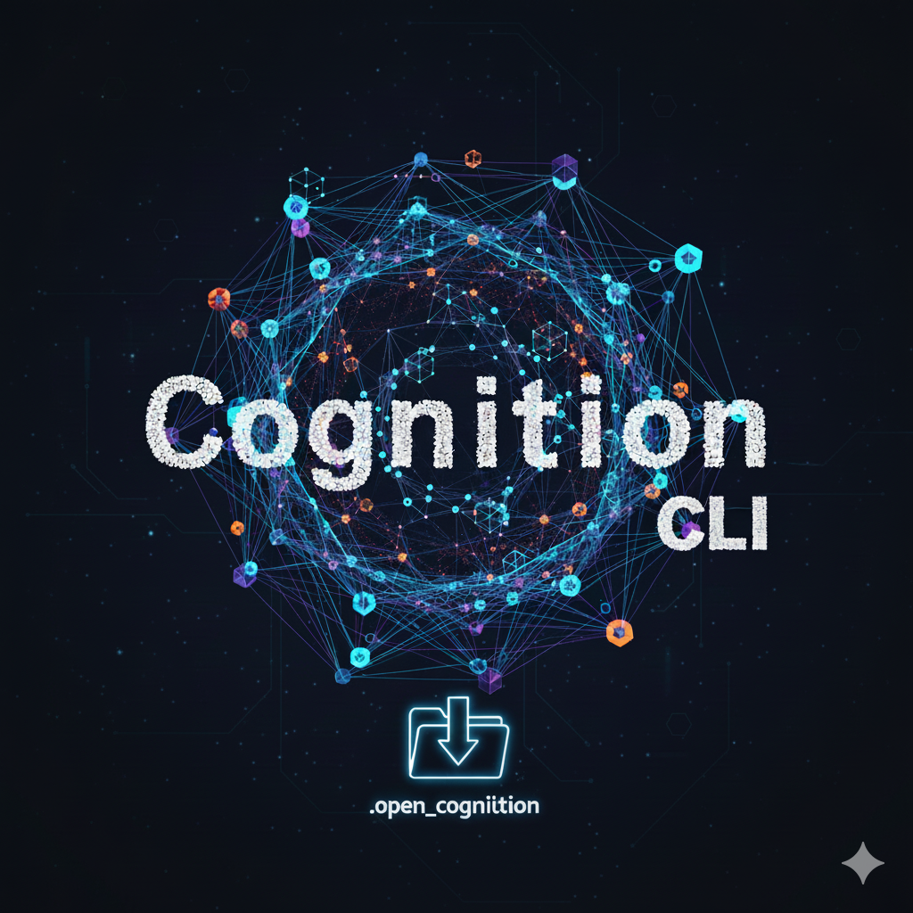

# Cognition Σ CLI

[](https://doi.org/10.5281/zenodo.17567109)

<div align="center" style="margin-top: 20px; margin-bottom: 20px;">

</div>

> **The reference implementation of the [CogX Architectural Blueprint](https://github.com/mirzahusadzic/cogx)** — A production-ready dual-lattice engine for verifiable AI-human symbiosis with infinite context.

Cognition Σ CLI is the working implementation of the **Grounded Context Pool (PGC)** combined with **Σ (Sigma) dual-lattice architecture**. It transforms your codebase into a queryable, verifiable knowledge graph with seven cognitive overlays (O₁-O₇), and provides an interactive TUI with true stateful AI that never forgets.

**Want the theory?** See the **[CogX Blueprint](../../README.md)** for mathematical foundations, axioms, and architectural vision.

---

## 🚀 Quick Start

```bash
# Install
cd src/cognition-cli
npm install && npm run build && npm link

# Navigate to your project
cd /path/to/your/project

# Run interactive setup wizard
cognition wizard

# Or manually initialize
cognition init
cognition genesis src/
cognition genesis:docs docs/

# Launch interactive TUI with infinite context
cognition tui
```

### LLM Provider Support

Cognition CLI supports multiple LLM providers:

- **Gemini** (Google) - Included by default
- **Claude** (Anthropic) - Optional, requires additional setup

#### Gemini (Default Provider)

```bash
# The Gemini SDK is included by default

# Set your API key
export GEMINI_API_KEY=your-key-here

# Launch TUI (uses Gemini by default)
cognition tui
```

**License**: Apache 2.0 (Open Source)

#### Enabling Claude Support

Due to licensing restrictions (cognition-cli is AGPL-3.0, Claude Agent SDK is proprietary),
the Claude provider requires manual installation.

**Installation (from source):**

```bash
git clone https://github.com/mirzahusadzic/cogx
cd cogx/src/cognition-cli
npm install
npm install @anthropic-ai/claude-agent-sdk  # Optional: for Claude support
npm run build
npm link  # Makes 'cognition-cli' available globally

# Now you can use it from anywhere
cd /path/to/your/project
cognition-cli tui --provider claude
```

Claude can be used with:

1. **API Key**: Set `ANTHROPIC_API_KEY` environment variable
2. **OAuth**: Authenticate via Claude Agent SDK CLI (no API key needed)

```bash
# With API key
ANTHROPIC_API_KEY=sk-ant-... cognition-cli tui --provider claude

# With OAuth (uses Claude Agent SDK authentication)
cognition-cli tui --provider claude
```

**Note:** If the Claude Agent SDK is not installed, cognition-cli will automatically fall back to Gemini.

**License**: Proprietary (Anthropic Commercial ToS)
By installing `@anthropic-ai/claude-agent-sdk`, you accept [Anthropic's Terms of Service](https://www.anthropic.com/legal/commercial-terms).

---

## 💡 What Is This?

**Two lattices working together:**

- **Project Lattice** (`.open_cognition/`) — Your codebase as a verifiable knowledge graph with 7-dimensional overlays
- **Conversation Lattice** (`.sigma/`) — AI memory built on-the-fly from chat, with intelligent compression

**The Result:** AI that never forgets, grounded in your project's truth, with zero hallucinations.

### The Breakthrough: Dual-Lattice Meet Operations

```
Project Lattice ∧ Conversation Lattice = Project Alignment Score
```

When context limit (150K tokens) is hit:

1. Flush conversation lattice to `.sigma/overlays/`
2. Query all 7 overlays for high-alignment turns
3. Generate 7-dimensional recap (O₁-O₇)
4. Transition to fresh session with intelligent systemPrompt
5. Add `recall_past_conversation` tool for on-demand deep memory

**Result:** True stateful AI with infinite context.

---

## 🎯 Core Workflows

### 1. Code Analysis & Pattern Discovery

```bash
# Build structural knowledge graph
cognition genesis src/

# Generate structural overlay
cognition overlay generate structural_patterns

# Find similar patterns
cognition patterns find-similar App

# Analyze blast radius
cognition blast-radius PGCManager
```

### 2. Interactive TUI with Infinite Context

```bash
# Launch interactive session with Gemini (default)
cognition tui

# Use Claude provider
cognition tui --provider claude

# Use specific model
cognition tui --provider claude --model claude-sonnet-4-5

# With debug mode to see turn analysis
cognition tui --debug

# Manage providers
cognition tui provider list
cognition tui provider set-default claude
```

**Features:**

- ✅ Multi-provider support (Claude & Gemini with unified UX)
- ✅ Thinking blocks visualization for extended reasoning
- ✅ Infinite context across sessions with intelligent compression
- ✅ Real-time lattice visualization with live stats
- ✅ Live overlay status (O₁-O₇) in status bar
- ✅ Token tracking with compression threshold (150K)
- ✅ Multiline input with improved paste handling
- ✅ ESC interrupt for aborting agent responses
- ✅ Tool execution with permission confirmation dialogs

**Learn more:** [TUI Documentation](./src/tui/README.md) | [SIGMA Architecture](docs/sigma/ARCHITECTURE.md)

### 3. PR Impact Analysis (O₁+O₂+O₃+O₄+O₇)

Comprehensive PR assessment combining all 5 overlays:

```bash
# Analyze current changes
cognition pr-analyze

# Analyze specific branch
cognition pr-analyze --branch feature/auth-refactor

# Export for CI/CD
cognition pr-analyze --json > pr-analysis.json
```

**Output includes:**

- 📦 Structural changes (O₁)
- 🔒 Security review (O₂)
- 💥 Blast radius (O₃)
- 🎯 Mission alignment (O₄)
- 📈 Coherence impact (O₇)
- ✅ Mergeable recommendation with risk score

### 4. Security Blast Radius (O₂+O₃)

Cascading security impact when a file/symbol is compromised:

```bash
# Analyze security impact
cognition security blast-radius src/auth.ts

# By symbol name
cognition security blast-radius validateToken

# Export for security audit
cognition security blast-radius src/auth.ts --json
```

**Use cases:**

- Vulnerability triage (prioritize by blast radius)
- Security code reviews
- Incident response (understand attack surface)

### 5. Real-Time Synchronization (The Three Monuments)

```bash
# Terminal 1: Start file watcher
cognition watch

# Terminal 2: Check status (< 10ms)
cognition status

# Terminal 2: Incremental update
cognition update
```

**The Complete Loop:**

```
watch → dirty_state.json → status → update → coherence restored ♻️
```

---

## 📋 Command Reference

| Command                   | Description                   | Learn More                                                         |
| :------------------------ | :---------------------------- | :----------------------------------------------------------------- |
| `init`                    | Initialize PGC structure      | [Getting Started](docs/guides/00_Introduction.md)                  |
| `genesis [path]`          | Build code knowledge graph    | [Structural Analysis](docs/guides/01_Structural_Analysis.md)       |
| `genesis:docs [path]`     | Ingest documentation          | [Mission Extraction](docs/guides/09_Mission_Concept_Extraction.md) |
| `watch`                   | Real-time file monitoring     | [Commands](docs/guides/03_Commands.md)                             |
| `status`                  | Instant coherence check       | [Commands](docs/guides/03_Commands.md)                             |
| `update`                  | Incremental sync              | [Commands](docs/guides/03_Commands.md)                             |
| `overlay generate <type>` | Generate analytical overlays  | [Commands](docs/guides/03_Commands.md)                             |
| `tui`                     | Interactive TUI with Σ system | [Claude Integration](docs/guides/08_Claude_CLI_Integration.md)     |
| `pr-analyze`              | Cross-overlay PR analysis     | [Commands](docs/guides/03_Commands.md)                             |
| `security blast-radius`   | Security impact analysis      | [Commands](docs/guides/03_Commands.md)                             |
| `patterns <command>`      | Structural pattern operations | [Structural Analysis](docs/guides/01_Structural_Analysis.md)       |
| `concepts <command>`      | Mission concept operations    | [Mission Extraction](docs/guides/09_Mission_Concept_Extraction.md) |
| `coherence <command>`     | Mission-code coherence        | [Mission Security](docs/guides/10_Mission_Security_Validation.md)  |
| `query <question>`        | Graph traversal               | [AI Analysis](docs/guides/07_AI_Grounded_Architecture_Analysis.md) |
| `audit <command>`         | PGC integrity verification    | [Verification](docs/guides/05_Verification_and_Oracles.md)         |

---

## 🏗️ Architecture Quick Reference

### Seven Overlays (O₁-O₇)

| Overlay | Name         | Purpose                                                 |
| :------ | :----------- | :------------------------------------------------------ |
| **O₁**  | Structural   | AST-based code structure, symbols, dependencies         |
| **O₂**  | Security     | Vulnerability & threat analysis, attack surface mapping |
| **O₃**  | Lineage      | Provenance & history, Git integration, authorship       |
| **O₄**  | Mission      | Strategic alignment, concept extraction, value scoring  |
| **O₅**  | Operational  | Workflow intelligence, quest patterns, procedures       |
| **O₆**  | Mathematical | Formal properties, proofs, invariants, theorems         |
| **O₇**  | Coherence    | Cross-overlay synthesis, consistency checking           |

**Deep dive:** [CogX Architecture](../../docs/architecture/README.md)

### Four Pillars

The PGC is built on four foundational pillars in `.open_cognition/`:

- **Objects** — Content-addressable immutable storage (like Git)
- **Transforms** — Append-only audit trail with fidelity scores
- **Index** — Human-readable path → hash mappings
- **Reverse Deps** — O(1) dependency lookup for instant impact analysis

**Deep dive:** [Core Infrastructure](docs/guides/02_Core_Infrastructure.md)

---

## 📖 Documentation

### Getting Started

- **[00 - Introduction](docs/guides/00_Introduction.md)** — Overview and core concepts
- **[Complete Lattice Book](https://mirzahusadzic.github.io/cogx)** — 26-chapter reference manual
- **[CogX Blueprint](../../README.md)** — Theoretical foundations and vision

### Implementation Guides

- **[01 - Structural Analysis](docs/guides/01_Structural_Analysis.md)** — Code understanding
- **[02 - Core Infrastructure (PGC)](docs/guides/02_Core_Infrastructure.md)** — Four pillars
- **[03 - Commands Reference](docs/guides/03_Commands.md)** — Complete CLI reference
- **[04 - Miners and Executors](docs/guides/04_Miners_and_Executors.md)** — Transform pipeline
- **[05 - Verification and Oracles](docs/guides/05_Verification_and_Oracles.md)** — Validation
- **[06 - Testing and Deployment](docs/guides/06_Testing_and_Deployment.md)** — Production usage

### Advanced Topics

- **[07 - AI-Grounded Architecture Analysis](docs/guides/07_AI_Grounded_Architecture_Analysis.md)** ⭐ — Zero-hallucination analysis
- **[08 - Claude Code Integration](docs/guides/08_Claude_CLI_Integration.md)** 🤖 — TUI details
- **[09 - Mission Concept Extraction](docs/guides/09_Mission_Concept_Extraction.md)** — Strategic alignment
- **[10 - Mission Security Validation](docs/guides/10_Mission_Security_Validation.md)** — Security validation
- **[11 - Internal Architecture](docs/guides/11_Internal_Architecture.md)** 🏗️ — System internals

### Architecture Documentation

- **[Comprehensive Analysis](docs/architecture/COMPREHENSIVE_ANALYSIS.md)** 📊 — Complete system analysis and metrics
- **[SIGMA Architecture](docs/sigma/ARCHITECTURE.md)** ⭐ — Official Σ architecture document
- **[Session Boundary Rationale](docs/sigma/SESSION_BOUNDARY_RATIONALE.md)** — Design patterns and rationale
- **[Dual-Use Mandate](docs/guides/DUAL_USE_MANDATE.md)** — Security philosophy
- **[Operational Lattice](docs/guides/OPERATIONAL_LATTICE.md)** — O₅ workflows
- **[Vision Document](docs/guides/VISION.md)** — Project vision and goals

---

## 🎉 Latest Release

**v2.5.1 - November 27, 2025** — [Gemini Integration](https://github.com/mirzahusadzic/cogx/releases/tag/v2.5.1):

- 🚀 **Full Gemini ADK Agent Integration** — Google Gemini joins as first-class provider with multi-turn BIDI streaming, tool execution, and memory recall
- 🏗️ **LLM Provider Abstraction Layer** — Future-proof pluggable architecture enabling easy addition of new LLM providers
- 🤖 **Enhanced Claude Integration** — Thinking blocks visualization, API key authentication, optional SDK for licensing flexibility
- 🎨 **TUI Improvements** — Multiline input support, ESC interrupt, improved paste handling, dynamic provider display
- 🛡️ **Tool Permission System** — Integrated permission callbacks for safe tool execution across all providers
- 🛠️ **SDK Error Handling** — Graceful handling of OAuth failures, no process.exit(1) crashes, benign JSON parsing error tolerance

**Impact:** Transformative release establishing Cognition Σ as a multi-provider platform with unified UX across Claude and Gemini.

**Previous releases:** [v2.5.0](https://github.com/mirzahusadzic/cogx/releases/tag/v2.5.0) | [v2.4.2](https://github.com/mirzahusadzic/cogx/releases/tag/v2.4.2) | [v2.4.1](https://github.com/mirzahusadzic/cogx/releases/tag/v2.4.1) | [v2.4.0](https://github.com/mirzahusadzic/cogx/releases/tag/v2.4.0) | [v2.0.0 - Σ Launch](https://github.com/mirzahusadzic/cogx/releases/tag/v2.0.0)

**Full changelog:** [CHANGELOG.md](./CHANGELOG.md)

---

## 🔬 Breakthroughs

### First Human-AI Grounded Collaboration (Oct 24, 2025)

**[AI-Grounded Architecture Analysis](docs/guides/07_AI_Grounded_Architecture_Analysis.md)**

- ✅ **Zero hallucinations** — Every claim backed by PGC data
- ✅ **100% reproducible** — Regenerate anytime
- ✅ **Meta-cognitive** — Cognition-cli analyzing itself
- ✅ **No source reading** — Reasoning from structured metadata alone

### Infinite Context via Dual-Lattice (Nov 3, 2025)

**[Interactive TUI with Σ System](./src/tui/README.md)**

- ✅ **Infinite context** — Agent never forgets across sessions
- ✅ **Dual-lattice Meet operations** — Project ∧ Conversation alignment
- ✅ **Intelligent compression** — Preserves project-relevant, discards noise
- ✅ **MCP memory tool** — `recall_past_conversation` for deep memory
- ✅ **Production tested** — 150K+ token sessions, zero context loss

**The Math:**

```
importance = novelty × 5 + max(alignment_O1..O7) × 0.5
if alignment ≥ 6: preserve in recap
if alignment < 6: discard
```

---

## 💙 Note to Anthropic

We built this **with** your Claude Agent SDK, not against it. This is research exploring how structured knowledge graphs + AI reasoning create better developer experiences.

**What we discovered:**

- The SDK is brilliant for building stateful systems
- MCP tools enable perfect custom memory integration
- Dual-lattice architecture preserves what matters, discards noise

**What we'd love to explore together:**

- Native overlay support in Claude Code?
- Distributed lattice sync for multi-agent collaboration?
- Optimal context sampling strategies?
- Proof-carrying code via O₆ (mathematical overlay)?

**Let's make AI + humans better together.**

Contact: **<mirza.husadzic@proton.me>**

---

## 🤝 Contributing

Contributions welcome! See **[CONTRIBUTING.md](../../CONTRIBUTING.md)** in the main repository.

---

## 📄 License & Prior Art

**License:** AGPL-v3 — See [LICENSE](../../LICENSE) file for details.

**NO WARRANTY. NO LIABILITY.** The entire risk as to quality and performance is with you.

### Defensive Publication

For the complete list of innovations (#1-46) protected as prior art and publication details, see:

👉 **[CogX README - Defensive Prior Art Publication](../../README.md#defensive-prior-art-publication)**

**Key innovations specific to this implementation:**

- Σ (Sigma) Dual-Lattice Architecture (#39)
- 7-Dimensional Conversation Overlays (#40)
- Intelligent Context Compression (#41)
- Session Lifecycle Management (#42)
- Interactive TUI with Real-Time Visualization (#46)

**Publication DOI:** [10.5281/zenodo.17635623](https://doi.org/10.5281/zenodo.17635623)

---

## 📚 Citation

If you use this work in research, please cite:

```bibtex
@software{cognition_cli_2025,
  author = {Husadžić, Mirza},
  title = {Cognition Σ CLI: Seven-Overlay Knowledge Graph with Infinite Context},
  year = {2025},
  version = {2.5.1},
  doi = {10.5281/zenodo.17567109},
  url = {https://github.com/mirzahusadzic/cogx/tree/main/src/cognition-cli}
}
```

---

**Built with ❤️ for human-AI symbiosis**
