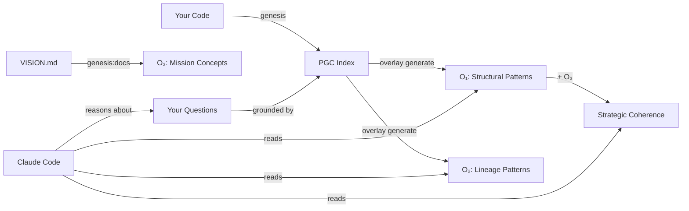

# 08 - Claude Code Integration: AI + PGC Symbiosis

**How `cognition-cli` and Claude Code work together to create a living, grounded development environment.**

---

## Overview

The `cognition-cli` is designed to work seamlessly with **Claude Code** (Anthropic's official CLI tool). Together, they create a powerful symbiosis:

- **Claude Code**: AI-powered coding assistant with deep reasoning capabilities
- **cognition-cli**: Verifiable, grounded knowledge graph of your codebase (PGC)
- **The Result**: AI reasoning anchored in cryptographic truth, not statistical approximation

This integration enables:

- ✅ **Grounded reasoning** - AI sees your actual architecture, not hallucinations
- ✅ **Mission alignment** - Track how code aligns with strategic vision
- ✅ **Impact analysis** - Understand blast radius before making changes
- ✅ **Living documentation** - PGC updates automatically with watch mode
- ✅ **Coherence checking** - Detect drift from architectural intent

---

## Table of Contents

### Getting Started

- **Quick Start** - 5-minute setup guide _(Coming Soon)_
- **Slash Commands** - Using `.claude/commands/` _(Coming Soon)_
- **Integration Patterns** - Common workflows _(Coming Soon)_

### Core Features

- **Structural Analysis** - Architecture exploration with AI _(Coming Soon)_
- **Impact Analysis** - Blast radius & dependency tracking _(Coming Soon)_
- **[O₃ Mission Alignment](./claude-integration/o3-mission-alignment.md)** ⭐ NEW
  - Mission concepts extraction
  - Strategic coherence scoring
  - Document integrity auditing

### Development Workflows

- **Best Practices** - Recommended patterns _(Coming Soon)_
- **Real-World Workflows** - End-to-end examples _(Coming Soon)_
- **Git Integration** - Pre-commit checks & PR reviews _(Coming Soon)_

### Reference

- **Command Reference** - All cognition-cli commands _(Coming Soon)_
- **Troubleshooting** - Common issues _(Coming Soon)_

---

## Quick Example

```bash
# 1. Initialize PGC and watch for changes
cognition-cli init
cognition-cli genesis src/
cognition-cli watch

# 2. In Claude Code, use slash commands
/status          # See what changed since last commit
/analyze-impact  # Understand blast radius
/coherence drifted  # Find code drifting from mission

# 3. Claude reasons about your code using grounded data
# All insights are backed by cryptographic provenance!
```

---

## What Makes This Different?

### Traditional AI Coding Assistants

```text
User: "Explain the architecture"
AI:   [Reads all code files]
      [Generates response based on pattern matching]
      ⚠️  May hallucinate non-existent patterns
      ⚠️  No provenance - can't verify claims
      ⚠️  Expensive context usage
```

### Claude Code + cognition-cli

```text
User: "Explain the architecture"
AI:   [Reads PGC structural patterns overlay]
      [Sees verified architectural roles]
      [Traces cryptographically-linked dependencies]
      ✅  Grounded in actual extracted structure
      ✅  Every claim has SHA-256 provenance
      ✅  Efficient - uses overlays, not raw code
```

---

## The Symbiosis Explained



**The Flow:**

1. **You write code** → PGC captures structure automatically (via `watch`)
2. **Overlays extract patterns** → O₁ (structure), O₂ (lineage), O₃ (mission)
3. **Claude reads overlays** → Gets grounded, verifiable understanding
4. **Claude assists you** → With insights backed by cryptographic provenance

---

## What's Next?

Choose your path:

### 🚀 **New User?**

Start with the **Quick Start** guide _(coming soon)_ to set up in 5 minutes.

### 🎯 **Want Practical Examples?**

See **Real-World Workflows** _(coming soon)_ for end-to-end scenarios.

### 🔬 **Interested in Mission Alignment?**

Explore **[O₃ Mission Alignment](./claude-integration/o3-mission-alignment.md)** to track strategic coherence.

### 📚 **Need Command Reference?**

Browse the **Command Reference** _(coming soon)_ for all available commands.

---

## Resources

- **cognition-cli Documentation**: See other docs in this directory
- **Claude Code Docs**: <https://docs.claude.com/claude-code>
- **GitHub Issues**: <https://github.com/your-org/cognition-cli/issues>
- **Slash Commands**: See `.claude/commands/` in this repo

---

**Ready to start?** Check out the docs above to get started with `cognition-cli` + Claude Code! →
