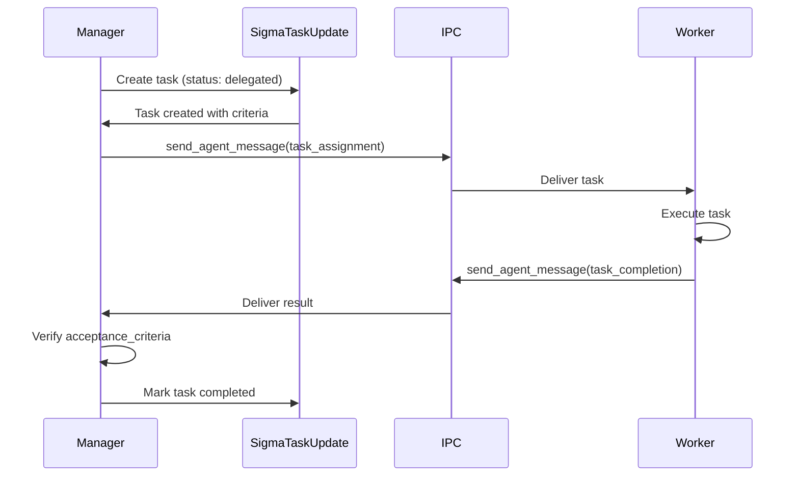

# SigmaTaskUpdate Delegation Architecture

## Overview

The SigmaTaskUpdate delegation system implements a **Manager/Worker pattern** that enables multi-agent collaboration through structured task assignment and completion tracking. This architecture allows agents to delegate complex subtasks to specialized workers while maintaining accountability through acceptance criteria and result verification.

## Table of Contents

- [Architecture Rationale](#architecture-rationale)
- [Core Components](#core-components)
- [Task Lifecycle](#task-lifecycle)
- [IPC Message Flows](#ipc-message-flows)
- [Schema Design](#schema-design)
- [Best Practices](#best-practices)
- [Troubleshooting](#troubleshooting)
- [Examples](#examples)

---

## Architecture Rationale

### Why Delegation?

**Problem**: Complex tasks often require:

- Specialized expertise across multiple domains
- Parallel execution of independent subtasks
- Distribution of workload across multiple agents
- Coordination between different LLM models (e.g., Opus for planning, Haiku for execution)

**Solution**: Manager/Worker delegation pattern where:

- **Managers** break down complex tasks and coordinate workers
- **Workers** execute specialized subtasks and report results
- **Acceptance Criteria** define success conditions before execution
- **Result Verification** ensures quality before marking completion

### Design Goals

1. **Accountability**: Managers verify worker results against predefined criteria
2. **Traceability**: Full audit trail through session IDs and task IDs
3. **Type Safety**: Zod schema validation prevents invalid delegation
4. **Persistence**: All delegation state persists across compressions
5. **Observability**: Debug logging for delegation lifecycle events

---

## Core Components

### 1. SigmaTaskUpdate Tool

**Location**: `src/sigma/sigma-task-update-tool.ts`, `src/llm/providers/gemini-adk-tools.ts`, `src/llm/providers/openai-agent-tools.ts`

**Purpose**: Unified task management across all providers (Claude, Gemini, OpenAI)

**Key Features**:

- Stable task IDs for tracking across sessions
- Delegation fields (acceptance_criteria, delegated_to, context)
- Schema validation ensuring delegation requirements
- State persistence in session files

### 2. Schema Validation

**Location**: Zod schema in tool definitions

**Validation Rules**:

```typescript
.refine((data) => {
  // When delegating, acceptance_criteria and delegated_to are required
  if (data.status === 'delegated') {
    return (
      data.acceptance_criteria &&
      data.acceptance_criteria.length > 0 &&
      data.delegated_to &&
      data.delegated_to.length > 0
    );
  }
  return true;
})
```

**Enforces**:

- `acceptance_criteria` must be non-empty array when delegating
- `delegated_to` must be non-empty string when delegating
- Prevents silent delegation failures

### 3. Session State Persistence

**Location**: `src/sigma/session-state.ts`

**Persistence Strategy**:

- Tasks stored in `.sigma/<anchor-id>.state.json`
- Survives compression events
- Automatic migration for legacy tasks without IDs
- Anchor ID-based file access (not SDK session UUID)

### 4. Agent Messaging (IPC)

**Location**: `src/ipc/` (MessageQueue, MessageQueueMonitor)

**Communication Flow**:

```
Manager                           Worker
   |                                 |
   ├──> send_agent_message ────────>│ (task assignment)
   |                                 │
   │<─── send_agent_message <────────┤ (task completion)
   |                                 |
```

---

## Task Lifecycle

### States

```
pending ───> in_progress ───> completed
                  │
                  └────> delegated ───> completed
                              │              ↑
                              └──────────────┘
                              (worker reports back)
```

### State Descriptions

| State         | Description                | Valid Transitions                  |
| ------------- | -------------------------- | ---------------------------------- |
| `pending`     | Task not started           | → `in_progress`, → `delegated`     |
| `in_progress` | Currently being worked on  | → `completed`, → `delegated`       |
| `delegated`   | Assigned to worker via IPC | → `completed` (after verification) |
| `completed`   | Finished and verified      | (terminal state)                   |

### Delegation Lifecycle



**Phases**:

1. **Assignment** (Manager):
   - Create task with `status: 'delegated'`
   - Set `delegated_to` (worker agent ID)
   - Define `acceptance_criteria` (success conditions)
   - Optionally add `context` (background info)
   - Send IPC message with task payload

2. **Execution** (Worker):
   - Receive IPC message
   - Execute task according to criteria
   - Track progress with own SigmaTaskUpdate
   - Prepare `result_summary`

3. **Completion** (Worker → Manager):
   - Send IPC message with result
   - Include `task_id` for correlation
   - Provide detailed `result_summary`

4. **Verification** (Manager):
   - Receive IPC message
   - Verify result against `acceptance_criteria`
   - Update task status to `completed`
   - Add `result_summary` to task record

---

## IPC Message Flows

### Task Assignment (Manager → Worker)

```json
{
  "type": "task_assignment",
  "task_id": "migrate-db-schema",
  "content": "Create database migration for new user fields",
  "acceptance_criteria": [
    "Migration script created in migrations/",
    "All tests pass",
    "No breaking changes to existing API"
  ],
  "context": "Adding OAuth fields to user table - keep existing auth flow intact",
  "priority": "high"
}
```

### Task Completion (Worker → Manager)

```json
{
  "type": "task_completion",
  "task_id": "migrate-db-schema",
  "status": "completed",
  "result_summary": "Created migration 20250120_add_oauth_fields.sql. All 127 tests passing. No API changes required.",
  "files_modified": [
    "migrations/20250120_add_oauth_fields.sql",
    "tests/migrations/test_oauth_fields.py"
  ]
}
```

### Task Blocked (Worker → Manager)

```json
{
  "type": "task_status",
  "task_id": "migrate-db-schema",
  "status": "blocked",
  "blocker": "Need database credentials for staging environment",
  "requested_action": "Please provide DB_HOST and DB_PASSWORD for staging",
  "attempted_solutions": [
    "Checked .env file (not found)",
    "Searched for credentials in config/ (none present)"
  ]
}
```

### Progress Update (Worker → Manager)

```json
{
  "type": "task_progress",
  "task_id": "migrate-db-schema",
  "status": "in_progress",
  "progress_summary": "Migration script created, running tests (87/127 passing)",
  "estimated_completion": "5 minutes",
  "next_steps": "Fixing remaining test failures in auth flow"
}
```

---

## Schema Design

### Task Object Schema

```typescript
{
  // Core fields (always required)
  id: string;                    // Stable identifier (nanoid, UUID, semantic slug)
  content: string;               // Imperative: "Fix authentication bug"
  activeForm: string;            // Continuous: "Fixing authentication bug"
  status: 'pending' | 'in_progress' | 'completed' | 'delegated';

  // Delegation fields (required when status === 'delegated')
  acceptance_criteria?: string[];   // Success conditions
  delegated_to?: string;            // Worker agent ID

  // Optional delegation fields
  context?: string;                 // Additional background
  delegate_session_id?: string;     // Worker session for audit
  result_summary?: string;          // Worker's completion report
}
```

### Validation Rules

**Required Fields** (all statuses):

- `id`: Non-empty string
- `content`: Non-empty string
- `activeForm`: Non-empty string
- `status`: One of enum values

**Conditional Requirements** (status === 'delegated'):

- `acceptance_criteria`: Non-empty array of strings
- `delegated_to`: Non-empty string
- **Validation fails** if either is missing or empty

---

## Best Practices

### For Managers

1. **Define Clear Acceptance Criteria**

   ```typescript
   // ✅ Good - Specific, measurable
   acceptance_criteria: [
     'All unit tests pass (npm test)',
     'Code coverage > 80%',
     'No breaking changes to public API',
     'Documentation updated',
   ];

   // ❌ Bad - Vague, unmeasurable
   acceptance_criteria: ['Works correctly', 'Looks good'];
   ```

2. **Provide Sufficient Context**

   ```typescript
   // ✅ Good - Background and constraints
   context: 'Refactoring auth system for OAuth2. Keep existing session-based auth for backward compatibility. Target completion: end of sprint.';

   // ❌ Bad - Insufficient info
   context: 'Fix auth';
   ```

3. **Verify Results Before Completing**
   - Don't blindly mark tasks complete
   - Check each acceptance criterion
   - Request clarification if criteria not met
   - Update task with `result_summary`

4. **Use Semantic Task IDs**

   ```typescript
   // ✅ Good - Descriptive
   id: 'fix-oauth-token-refresh';

   // ❌ Bad - Generic
   id: 'task-123';
   ```

### For Workers

1. **Acknowledge Task Receipt**
   - Send immediate confirmation via IPC
   - Clarify ambiguities before starting
   - Request additional context if needed

2. **Provide Detailed Result Summaries**

   ```typescript
   // ✅ Good - Comprehensive
   result_summary: 'Implemented OAuth2 token refresh. Added /auth/refresh endpoint. All 127 tests passing. Updated API docs. Breaking change: old /auth/renew endpoint removed (deprecated since v2.1).';

   // ❌ Bad - Too brief
   result_summary: 'Done';
   ```

3. **Report Blockers Early**
   - Don't wait until deadline
   - Explain what was attempted
   - Suggest alternative approaches
   - Request specific help

4. **Track Subtasks Locally**
   - Use own SigmaTaskUpdate for subtasks
   - Keeps work organized
   - Provides progress visibility

### General Guidelines

1. **One Delegation per Task**
   - Don't delegate same task multiple times
   - Use single worker for accountability
   - For parallel work, create separate tasks

2. **Timeout Handling**
   - Set reasonable deadlines
   - Check progress periodically
   - Have fallback plans for unresponsive workers

3. **Security Considerations**
   - Validate worker identity before delegating sensitive tasks
   - Don't include credentials in IPC messages
   - Use secure channels for sensitive context

4. **Debugging Delegation**

   ```bash
   # Enable delegation logging
   DEBUG_DELEGATION=1 npm start

   # Output shows:
   # [Sigma] Delegation lifecycle events:
   #   📋 Task: fix-oauth-token → Delegated to: haiku2
   #   → Acceptance criteria: All tests pass, No breaking changes
   #   → Context: Refactoring auth system...
   ```

---

## Troubleshooting

### Problem: Task marked delegated but worker never responded

**Symptoms**:

- Task stuck in `delegated` status
- No IPC message received from worker

**Diagnosis**:

```bash
# Check if worker is active
list_agents

# Check pending messages
list_pending_messages

# Enable debug logging
DEBUG_DELEGATION=1 npm start
```

**Solutions**:

1. Verify worker agent ID is correct
2. Check worker is still running (`list_agents`)
3. Resend IPC message (worker may have missed it)
4. Cancel delegation and re-assign to different worker
5. Execute task directly if worker unavailable

---

### Problem: Schema validation error on delegation

**Symptoms**:

```
Error: Tasks with status 'delegated' must have 'acceptance_criteria' and 'delegated_to' fields
```

**Solutions**:

1. Ensure both fields are present:

   ```typescript
   {
     status: 'delegated',
     delegated_to: 'worker-id',  // ✅ Present
     acceptance_criteria: ['Must pass tests']  // ✅ Present
   }
   ```

2. Check fields are non-empty:

   ```typescript
   // ❌ Empty array - validation fails
   acceptance_criteria: [];

   // ✅ Non-empty array
   acceptance_criteria: ['Must complete'];
   ```

---

### Problem: Task migration warnings on session load

**Symptoms**:

```
[Session State] Migrating task without ID: "Fix bug" → migrated-0-1234567890
```

**Cause**: Loading session created before `id` field was required

**Solution**: Migration is automatic - no action needed. Task gets generated ID (`migrated-{index}-{timestamp}`)

---

### Problem: Worker completed task but manager can't verify criteria

**Symptoms**:

- Worker reports completion
- Manager uncertain if criteria met
- Result summary too vague

**Solutions**:

1. Request detailed breakdown from worker:

   ```json
   {
     "type": "clarification_request",
     "task_id": "...",
     "question": "Please confirm: did tests pass? (npm test output)"
   }
   ```

2. Define more specific criteria next time:

   ```typescript
   // Before
   acceptance_criteria: ['Tests pass'];

   // After
   acceptance_criteria: [
     'npm test exits with code 0',
     'All 127 tests passing',
     'No test skipped or pending',
   ];
   ```

---

## Examples

### Example 1: Simple Delegation

**Scenario**: Manager delegates database backup to worker

```typescript
// Manager: Create delegated task
await SigmaTaskUpdate({
  todos: [
    {
      id: 'backup-production-db',
      content: 'Backup production database',
      activeForm: 'Delegating database backup',
      status: 'delegated',
      delegated_to: 'haiku1',
      acceptance_criteria: [
        'Backup file created in /backups/',
        'Backup file size > 100MB',
        'Backup integrity verified (checksum matches)'
      ],
      context: 'Production backup before schema migration. Critical - do not skip verification.'
    }
  ]
});

// Manager: Send IPC message
await send_agent_message({
  to: 'haiku1',
  message: JSON.stringify({
    type: 'task_assignment',
    task_id: 'backup-production-db',
    content: 'Backup production database',
    acceptance_criteria: [
      'Backup file created in /backups/',
      'Backup file size > 100MB',
      'Backup integrity verified (checksum matches)'
    ],
    context: 'Production backup before schema migration.'
  })
});

// Worker: Execute and report
await send_agent_message({
  to: 'manager-id',
  message: JSON.stringify({
    type: 'task_completion',
    task_id: 'backup-production-db',
    status: 'completed',
    result_summary: 'Backup created: /backups/prod-20250120-1430.sql.gz (487MB). SHA256: abc123... Verified successfully.'
  })
});

// Manager: Verify and complete
await SigmaTaskUpdate({
  todos: [
    {
      id: 'backup-production-db',
      content: 'Backup production database',
      activeForm: 'Completed',
      status: 'completed',
      delegated_to: 'haiku1',
      acceptance_criteria: [...],
      result_summary: 'Backup created: /backups/prod-20250120-1430.sql.gz (487MB). SHA256: abc123... Verified successfully.'
    }
  ]
});
```

---

### Example 2: Parallel Delegation

**Scenario**: Manager delegates 3 independent tasks to different workers

```typescript
// Manager: Create 3 delegated tasks
await SigmaTaskUpdate({
  todos: [
    {
      id: 'update-docs',
      content: 'Update API documentation',
      activeForm: 'Delegating documentation update',
      status: 'delegated',
      delegated_to: 'sonnet1',
      acceptance_criteria: ['Docs updated', 'Examples included'],
    },
    {
      id: 'write-tests',
      content: 'Write integration tests',
      activeForm: 'Delegating test writing',
      status: 'delegated',
      delegated_to: 'haiku2',
      acceptance_criteria: ['All endpoints covered', '> 80% coverage'],
    },
    {
      id: 'optimize-queries',
      content: 'Optimize database queries',
      activeForm: 'Delegating query optimization',
      status: 'delegated',
      delegated_to: 'flash1',
      acceptance_criteria: ['Query time < 100ms', 'No N+1 queries'],
    },
  ],
});

// Workers execute in parallel, report independently
// Manager verifies each completion separately
```

---

## Monitoring and Observability

### Debug Logging

Enable delegation logging with environment variable:

```bash
DEBUG_DELEGATION=1 npm start
```

**Output format**:

```
[Sigma] Delegation lifecycle events:
  📋 Task: optimize-queries - Optimize database queries
     → Delegated to: flash1
     → Acceptance criteria: Query time < 100ms, No N+1 queries
     → Context: Performance optimization sprint
  ✅ Result: Optimized 12 queries, avg time now 45ms
     → Session: session-abc-123
```

### Audit Trail

Delegation audit trail stored in session state:

```json
{
  "anchor_id": "tui-1234567890",
  "todos": [
    {
      "id": "optimize-queries",
      "status": "delegated",
      "delegated_to": "flash1",
      "delegate_session_id": "session-abc-123",
      "acceptance_criteria": [...],
      "result_summary": "..."
    }
  ]
}
```

---

## Future Enhancements

### Planned Features

1. **Delegation Timeout**: Auto-reassign if worker doesn't respond within deadline
2. **Worker Priority Queue**: Workers pull tasks based on priority
3. **Delegation Rollback**: Cancel delegation and return task to manager
4. **Multi-Worker Delegation**: Split large tasks across multiple workers
5. **Delegation Metrics**: Track success rate, average completion time
6. **Worker Health Checks**: Periodic pings to verify worker availability

---

## References

- [SigmaTaskUpdate Implementation](../../src/sigma/sigma-task-update-tool.ts)
- [Schema Validation](../../src/llm/providers/gemini-adk-tools.ts#L722-L735)
- [Session State Persistence](../../src/sigma/session-state.ts)
- [IPC Message Queue](../../src/ipc/MessageQueue.ts)
- [Agent Messaging Tools](../../src/ipc/agent-messaging-tool.ts)

---

## Changelog

- **2025-01-20**: Initial delegation architecture documentation
- **2025-01-20**: Added IPC message format examples and troubleshooting guide
- **2025-01-20**: Added debug logging and monitoring sections
