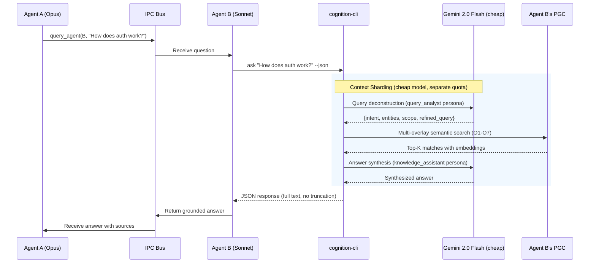

# PGC-Aware Delegation Protocol

**Status**: Draft
**Author**: Cognition Team
**Date**: 2025-01-23
**Version**: 2.0

---

## 1. Introduction & Objectives

### Problem Statement

Current task delegation via `SigmaTaskUpdate` + `send_agent_message` is free-form. There's no protocol for:

1. Telling the worker agent **how** to use its PGC (Grounded Context Pool)
2. Requiring **grounded evidence** in responses
3. Specifying **which overlays** are most relevant
4. Validating that the answer came from the lattice, not hallucination

### Core Goals

1. **Efficiency**: Workers query pre-indexed PGC instead of cold-reading code
2. **Grounding**: Responses must cite lattice sources (O₁-O₇ overlays)
3. **Verification**: Managers validate evidence before marking tasks complete
4. **Backward Compatibility**: Optional grounding—legacy workers still function

### Terminology

| Term                 | Definition                                                                                                                                                                                                                                                                                                                                                      |
| -------------------- | --------------------------------------------------------------------------------------------------------------------------------------------------------------------------------------------------------------------------------------------------------------------------------------------------------------------------------------------------------------- |
| **PGC**              | Grounded Context Pool - A multi-overlay semantic knowledge base built from codebase analysis                                                                                                                                                                                                                                                                    |
| **Overlays (O₁-O₇)** | Seven specialized views of the codebase: O₁ (Structural - AST, symbols, dependencies), O₂ (Security - vulnerabilities, attack surface), O₃ (Lineage - provenance, Git history), O₄ (Mission - strategic alignment, concepts), O₅ (Operational - workflows, procedures), O₆ (Mathematical - formal properties, proofs), O₇ (Coherence - cross-overlay synthesis) |
| **Lattice**          | The unified multi-dimensional embedding space combining all overlays                                                                                                                                                                                                                                                                                            |
| **Grounding**        | The process of backing responses with citations from the PGC lattice                                                                                                                                                                                                                                                                                            |
| **Manager/Worker**   | IPC delegation pattern where Manager delegates tasks to Worker agents                                                                                                                                                                                                                                                                                           |

---

## 2. Data Contracts (Schemas)

### Request: DelegatedTask

```typescript
interface DelegatedTask {
  // Core task info (existing fields, unchanged)
  id: string;
  task: string;
  acceptance_criteria: string[];
  context?: string;

  // NEW: Optional PGC Grounding Instructions
  // If absent, worker executes in legacy mode (strategy: 'none')
  grounding?: {
    /**
     * Strategy for how worker should approach the task
     * - "pgc_first": Query PGC before any code changes
     * - "pgc_verify": Use PGC to verify proposed changes
     * - "pgc_cite": Must cite PGC sources in response
     * - "none": Free-form (legacy behavior)
     */
    strategy: 'pgc_first' | 'pgc_verify' | 'pgc_cite' | 'none';

    /**
     * Computational hints for specific PGC analyses
     * @experimental Phase 2 - Advanced analysis not required for v1
     */
    analysis_hints?: Array<{
      /**
       * - "blast_radius": Impact analysis for symbol changes
       * - "security_impact": Cross-overlay security risk assessment
       * - "dependency_check": Structural dependency verification
       * - "algebra_query": Multi-overlay composition (e.g. O1 + O4)
       */
      type:
        | 'blast_radius'
        | 'security_impact'
        | 'dependency_check'
        | 'algebra_query';
      target: string;
      options?: Record<string, any>;
    }>;

    /**
     * Overlay Algebra composition string (e.g. "O1 + O2", "O1 ∩ O4")
     * @experimental Phase 2 - Reserved for future semantic intersection
     */
    algebra_expression?: string;

    /**
     * Hints about which overlays are most relevant
     * Helps worker focus lattice queries
     */
    overlay_hints?: Array<'O1' | 'O2' | 'O3' | 'O4' | 'O5' | 'O6' | 'O7'>;

    /**
     * Semantic query hints for the worker's PGC
     * Worker should run these queries before acting
     */
    query_hints?: string[];

    /**
     * Whether response must include evidence citations
     */
    evidence_required?: boolean;
  };
}
```

### Response: TaskResponse

```typescript
interface TaskResponse {
  task_id: string;
  status: 'completed' | 'failed' | 'blocked';
  result: string;

  // NEW: Grounding evidence (optional if grounding not requested)
  grounding_evidence?: {
    /** Queries run against PGC */
    queries_executed: string[];

    /** Overlays consulted */
    overlays_consulted: Array<'O1' | 'O2' | 'O3' | 'O4' | 'O5' | 'O6' | 'O7'>;

    /**
     * Key insights from lattice
     * @limit Max 10 citations to prevent IPC bloat
     */
    citations: Array<{
      overlay: string;
      /**
       * Snippet content
       * @limit Max 500 chars per citation. Use file path for full context.
       */
      content: string;
      relevance: string;
      file_path?: string; // For manager to read full context if needed
    }>;

    /**
     * Confidence that response is grounded
     * Computed by worker based on vector similarity:
     * - high: > 0.85 avg similarity
     * - medium: 0.7 - 0.85
     * - low: < 0.7
     */
    grounding_confidence: 'high' | 'medium' | 'low';
  };
}
```

---

## 3. Grounding Strategies & Mechanisms

### API Surface: `ask --json`

Workers query their PGC using the `ask` command with JSON output:

```bash
cognition-cli ask "How does session compression work?" --json
```

**Returns structured JSON:**

```json
{
  "question": "How does session compression work?",
  "answer": "Session compression is a process that can be enabled and configured using `CompressionOptions`, which allows setting parameters like a `tokenThreshold` and `minTurns`. The `compressContext` function performs the actual compression. When compression occurs, it triggers a `SessionUpdateEvent` with the reason 'compression', and the number of `compressedTokens` is recorded. The `SessionState` maintains a `compression_history` that logs these events, including the timestamp and the number of tokens involved.",
  "query_intent": {
    "intent": "conceptual_overview",
    "entities": ["session compression", "mechanism"],
    "scope": "conceptual",
    "refined_query": "mechanism and process of session compression"
  },
  "sources": [
    {
      "overlay": "O1",
      "section": "O1",
      "text": "function:useCompression | params:1 | returns:UseCompressionResult | async:false",
      "similarity": 0.5328465282382895,
      "weight": 1
    },
    {
      "overlay": "O1",
      "section": "O1",
      "text": "function:compressContext | params:2 | returns:Promise<CompressionResult> | async:true",
      "similarity": 0.5271795362811473,
      "weight": 1
    },
    {
      "overlay": "O1",
      "section": "O1",
      "text": "interface:SessionUpdateEvent | properties:4 | shape:{reason:'compression'|'expiration'|'restart',compressedTokens:number?,...}",
      "similarity": 0.4973341535057919,
      "weight": 1
    },
    {
      "overlay": "O1",
      "section": "O1",
      "text": "interface:CompressionOptions | properties:3 | shape:{tokenThreshold:number?,minTurns:number?,enabled:boolean?}",
      "similarity": 0.4801590821541216,
      "weight": 1
    },
    {
      "overlay": "O1",
      "section": "O1",
      "text": "interface:SessionState | properties:9 | shape:{compression_history:Array<{...}>,stats:{...},...}",
      "similarity": 0.4798942872904351,
      "weight": 1
    }
  ],
  "metadata": {
    "question_hash": "f587deeadeec2f91d2db16166046d3eb81948b3a7cd7a14737e106c8c8614ca5",
    "top_k": 5,
    "elapsed_ms": 2376
  }
}
```

**Why `ask --json`?**

- Agents run in separate processes (shell exec is natural boundary)
- Uses **Gemini 2.0 Flash** (4M TPM, unlimited RPD - essentially free) for query decomposition + synthesis
- Returns full source text (no truncation)
- Already implemented ✅

### Grounding Strategy Behaviors

| Strategy     | When to Use                   | Worker Behavior                                                            |
| ------------ | ----------------------------- | -------------------------------------------------------------------------- |
| `pgc_first`  | Complex features, refactoring | Query PGC before proposing solution. Use insights to guide implementation. |
| `pgc_verify` | Bug fixes, targeted changes   | Propose solution first, then verify against PGC for correctness/safety.    |
| `pgc_cite`   | Documentation, explanations   | Response must include citations but no strict query order.                 |
| `none`       | Simple tasks, legacy mode     | Free-form execution, no grounding required.                                |

### Computational Grounding Commands

For advanced analysis (Phase 2), workers can use specialized CLI commands:

| Command Type       | CLI Equivalent                          | Grounding Value                                                      |
| ------------------ | --------------------------------------- | -------------------------------------------------------------------- |
| `blast_radius`     | `blast-radius <target> --json`          | Prevents regression by identifying downstream consumers (O₃ Lineage) |
| `security_impact`  | `security blast-radius <target> --json` | Detects if local change introduces global security risk (O₁+O₂)      |
| `algebra_query`    | `ask "<query>" --overlays O1,O4`        | Intersects structural code (O₁) with mission concepts (O₄)           |
| `dependency_check` | `patterns --filter dependencies`        | Validates architectural boundaries (O₁ Structural)                   |

---

## 4. Execution Workflows

### Local Worker Flow (Intra-Project)

```typescript
// Worker receives task with grounding instructions
const task: DelegatedTask = JSON.parse(message);

// If no grounding field, execute in legacy mode
if (!task.grounding || task.grounding.strategy === 'none') {
  // ... execute task normally ...
  return;
}

// Step 1: Query PGC per hints
const pgcContext = [];
for (const hint of task.grounding.query_hints || []) {
  const result = await execSync(`cognition-cli ask "${hint}" --json`, {
    encoding: 'utf-8',
  });
  const parsed = JSON.parse(result);
  pgcContext.push(parsed);
}

// Step 2: Execute task with grounded context
// ... use pgcContext.sources to inform solution ...

// Step 3: Report back with evidence
const response: TaskResponse = {
  task_id: task.id,
  status: 'completed',
  result: 'Summary of what was done',
  grounding_evidence: {
    queries_executed: task.grounding.query_hints,
    overlays_consulted: ['O1', 'O3'],
    citations: pgcContext
      .flatMap((ctx) =>
        ctx.sources.slice(0, 2).map((s) => ({
          overlay: s.overlay,
          content: s.text.slice(0, 500), // Truncate to 500 chars
          relevance: 'How this informed the solution',
          file_path: s.file_path,
        }))
      )
      .slice(0, 10), // Max 10 citations
    grounding_confidence: computeConfidence(pgcContext),
  },
};

send_agent_message(managerAgentId, JSON.stringify(response));
```

### Cross-Project Query Flow

For querying a different project's PGC, use the `query_agent()` MCP tool:



**Key benefits:**

- **Cost efficiency**: Opus (expensive) delegates to Gemini 2.0 Flash (essentially free, separate quota pool)
- **Context sharding**: Each agent uses its own PGC, no cold reading
- **Full fidelity**: `--json` returns complete source text
- **Pre-indexed knowledge**: Agent B has O₁-O₇ ready

### Knowledge Routing & Fractal Lattice Architecture

**"The Mesh is not a swarm. It is a single, distributed nervous system."**

**The Breakthrough**: Queries can traverse dependency chains across agent boundaries, enabling analysis of massive codebases.

#### Scaling to Monolithic Codebases

For large codebases (5M+ LOC), a single PGC lattice becomes unwieldy. The solution: **fractal decomposition**.

**Example: Linux Kernel (5M LOC)**

```
Linux Kernel Decomposition
├─ arch/           (800K LOC)  → 8-16 agents
├─ drivers/        (2.5M LOC)  → 25-50 agents
│  ├─ gpu/         (500K LOC)  → 5-10 agents
│  ├─ net/         (400K LOC)  → 4-8 agents
│  └─ ...
├─ fs/             (500K LOC)  → 5-10 agents
├─ kernel/         (400K LOC)  → 4-8 agents
├─ mm/             (200K LOC)  → 2-4 agents
├─ net/            (600K LOC)  → 6-12 agents
└─ ...

Total: 50-100 agents @ 50-100K LOC each
All connected via IPC_SIGMA_BUS
```

**Economic Model**:

- Per-agent queries: Gemini 2.0 Flash (4M TPM, unlimited RPD - negligible cost)
- 100 agents × ~$0/month = **effectively free**
- Manager agents (Opus/Sonnet): Only for human-facing synthesis
- Cross-lattice routing: Local IPC, no network costs

#### Transitive Query Routing

Queries can follow **dependency chains** through the lattice mesh:

```
Question: "How does the e1000 network driver allocate DMA buffers?"

Manager decomposes into multi-hop query:

┌─────────────────────────────────────────────────────┐
│           Manager Agent (Query Orchestrator)        │
└─────────────┬───────────────────────────────────────┘
              │
    ┌─────────┼─────────────────────────────┐
    │         │                             │
    ▼         ▼                             ▼
┌────────┐ ┌─────────┐ ┌────────┐ ┌──────────┐
│  net/  │ │drivers/ │ │kernel/ │ │   mm/    │
│ agent  │ │  agent  │ │ agent  │ │  agent   │
│ PGC    │ │  PGC    │ │  PGC   │ │   PGC    │
└───┬────┘ └────┬────┘ └───┬────┘ └─────┬────┘
    │           │           │            │
    │ O₃        │ O₃        │ O₃         │ O₃
    │Lineage    │Lineage    │Lineage     │Lineage
    └─┬─────────┴─────┬─────┴──────┬─────┘
      │               │            │
      ▼               ▼            ▼
   "e1000" → "calls dma_alloc" → "mm implementation"
```

**Implementation Pattern**:

```typescript
// Manager orchestrates multi-hop query
async function queryDependencyChain(
  question: string,
  maxHops: number = 6 // Safety: prevent infinite loops
) {
  const path: string[] = [];
  const results: any[] = [];
  const visitedAgents = new Set<string>(); // Track visited agents

  // Step 1: Entry point (net subsystem)
  const netAgent = 'net-agent';
  if (visitedAgents.has(netAgent)) {
    throw new Error('Cycle detected: net-agent already visited');
  }
  visitedAgents.add(netAgent);

  const netResult = await query_agent(
    netAgent,
    'Which driver handles e1000 NIC?',
    { grounding: { overlay_hints: ['O1'] } }
  );
  path.push('net/');
  results.push(netResult);
  // Returns: "drivers/net/ethernet/intel/e1000/"

  // Step 2: Follow to driver subsystem
  if (path.length >= maxHops) {
    throw new Error(`Max hops (${maxHops}) exceeded`);
  }
  const driverAgent = 'drivers-net-agent';
  if (visitedAgents.has(driverAgent)) {
    throw new Error(`Cycle detected: ${driverAgent} already visited`);
  }
  visitedAgents.add(driverAgent);

  const driverResult = await query_agent(
    driverAgent,
    'How does e1000 allocate RX buffers?',
    {
      grounding: {
        overlay_hints: ['O3'], // Use Lineage for call chains!
        query_hints: ['buffer allocation', 'DMA setup'],
      },
    }
  );
  path.push('drivers/net/ethernet/intel/e1000/');
  results.push(driverResult);
  // Returns: "Calls dma_alloc_coherent() from kernel/dma/"

  // Step 3: Traverse to kernel
  if (path.length >= maxHops) {
    throw new Error(`Max hops (${maxHops}) exceeded`);
  }
  const kernelAgent = 'kernel-dma-agent';
  if (visitedAgents.has(kernelAgent)) {
    throw new Error(`Cycle detected: ${kernelAgent} already visited`);
  }
  visitedAgents.add(kernelAgent);

  const kernelResult = await query_agent(
    kernelAgent,
    'What does dma_alloc_coherent() do?',
    { grounding: { overlay_hints: ['O1', 'O3'] } }
  );
  path.push('kernel/dma/');
  results.push(kernelResult);
  // Returns: "Wrapper around mm/dma-mapping.c:__dma_alloc()"

  // Step 4: Final hop to mm subsystem
  if (path.length >= maxHops) {
    throw new Error(`Max hops (${maxHops}) exceeded`);
  }
  const mmAgent = 'mm-agent';
  if (visitedAgents.has(mmAgent)) {
    throw new Error(`Cycle detected: ${mmAgent} already visited`);
  }
  visitedAgents.add(mmAgent);

  const mmResult = await query_agent(
    mmAgent,
    'How does __dma_alloc() work internally?',
    { grounding: { overlay_hints: ['O1', 'O6'] } } // Structural + Mathematical
  );
  path.push('mm/dma-mapping.c');
  results.push(mmResult);
  // Returns: Implementation with formal properties

  // Synthesize complete answer
  return {
    query_path: path,
    knowledge_chain: results,
    answer: synthesizeCrossSubsystem(results),
    total_agents_queried: visitedAgents.size,
    total_cost: '$0.00', // All Gemini 2.0 Flash
    safety: {
      max_hops: maxHops,
      actual_hops: path.length,
      visited_agents: Array.from(visitedAgents),
    },
  };
}
```

#### O₃ (Lineage) Enables Routing

The **Lineage overlay** is critical for cross-lattice routing:

```bash
# Worker agent uses O₃ to find call chains
cognition-cli ask "e1000_alloc_rx_buffers call chain" \
  --overlays O3 \
  --json

# Returns Lineage data:
{
  "sources": [
    {
      "overlay": "O3",
      "text": "Call chain: net/core/dev.c:netdev_alloc_skb() →
              drivers/net/ethernet/intel/e1000/e1000_main.c:e1000_alloc_rx_buffers() →
              kernel/dma/mapping.c:dma_alloc_coherent() →
              mm/dma-mapping.c:__dma_alloc()",
      "similarity": 0.89
    }
  ]
}
```

#### Optimal Query Path Finding

Manager agents can optimize routing using topology awareness:

```typescript
// Build dependency graph from IPC_SIGMA_BUS discovery
// NOTE: Requires IPC AgentInfo to include 'scope' field
// (e.g., { alias: "net-agent", scope: "net/", ... })
const topology = await discoverLatticeTopology();
// {
//   'net': ['drivers', 'kernel'],
//   'drivers': ['kernel', 'mm'],
//   'kernel': ['mm', 'fs'],
//   'mm': []  // Leaf node
// }

// Find shortest path: net → mm
function findQueryPath(
  from: string,
  to: string,
  maxHops: number = 6 // Safety limit
): string[] {
  // BFS through topology graph
  const visited = new Set<string>();
  const queue: string[][] = [[from]];

  while (queue.length > 0) {
    const path = queue.shift()!;
    const current = path[path.length - 1];

    // Safety checks
    if (path.length > maxHops) {
      console.warn(`Max hops (${maxHops}) exceeded in path finding`);
      return []; // Abandon search
    }

    if (current === to) return path;
    if (visited.has(current)) continue;

    visited.add(current);
    for (const neighbor of topology[current] || []) {
      // Cycle detection: don't revisit nodes in current path
      if (!path.includes(neighbor)) {
        queue.push([...path, neighbor]);
      }
    }
  }

  return []; // No path found
}

// Execute multi-hop query along optimal path
const path = findQueryPath('net', 'mm', 6);
if (path.length === 0) {
  throw new Error('No valid path found or max hops exceeded');
}
// Returns: ['net', 'drivers', 'kernel', 'mm']

let context = 'How does network DMA allocation work?';
const hops = [];
const visitedAgents = new Set<string>();

for (const subsystem of path) {
  const agentId = `${subsystem}-agent`;

  // Safety: detect cycles
  if (visitedAgents.has(agentId)) {
    throw new Error(`Cycle detected: ${agentId} visited twice`);
  }
  visitedAgents.add(agentId);

  const result = await query_agent(agentId, context, {
    grounding: { overlay_hints: ['O3'] }, // Follow dependencies
  });

  hops.push(result);
  context = refineQuestion(context, result); // Narrow focus for next hop
}

// Synthesize answer from all hops
const finalAnswer = synthesize(hops);
```

#### Real-World Scalability

**Linux Kernel Example**:

| Metric             | Value                  |
| ------------------ | ---------------------- |
| Total LOC          | 5M+                    |
| Subsystems         | ~15 major              |
| Agents required    | 50-100                 |
| PGC size per agent | 50-200MB               |
| Total storage      | 2.5-20GB               |
| Query cost per hop | ~$0 (Gemini 2.0 Flash) |
| Multi-hop queries  | 3-6 hops typical       |
| Total query cost   | ~$0.00                 |

**Query Performance**:

- Single-hop query: ~2-3 seconds (PGC lookup + synthesis)
- 4-hop query: ~8-12 seconds (parallel execution possible)
- Cross-subsystem analysis: Feasible at scale

**Key Insight**: The fractal lattice architecture **scales linearly** because:

1. Each agent manages a small PGC (50-100K LOC)
2. Queries route through dependency graph efficiently
3. Gemini 2.0 Flash (4M TPM quota) makes routing essentially free
4. Manager agents only needed for final human-facing synthesis

### Usage Decision Tree

```
Need info from different project?
  ├─ YES → Use query_agent() MCP tool (cross-project)
  └─ NO → Use ask --json (intra-project)
      ├─ Need computational analysis? → Use blast-radius/security commands
      └─ Need semantic search? → Use ask --json with query hints
```

---

## 5. Error Handling & Robustness

### Error Scenarios & Fallback Behaviors

#### 1. Worker Doesn't Support Grounding Protocol

**Scenario**: Worker is running older version without grounding support.

**Detection**: Manager receives response without `grounding_evidence` despite `evidence_required: true`.

**Fallback**:

- Manager marks task as `failed` with reason `PROTOCOL_MISMATCH`
- Re-assigns task to a capable agent
- Logs version mismatch for upgrade tracking

**Prevention**: Workers implement feature detection:

```typescript
if ('grounding' in task) {
  // Execute with grounding
} else {
  // Legacy mode - still flag version in response
  response.protocol_version = '1.0-legacy';
}
```

#### 2. PGC Query Failure or Timeout

**Scenario**: `ask --json` command fails (PGC not generated, disk error, timeout).

**Detection**: Worker catches exception when executing PGC query.

**Fallback**:

- Worker reports `grounding_confidence: 'low'`
- Includes error details in `grounding_evidence.citations`:

  ```json
  {
    "overlay": "error",
    "content": "PGC query failed: ask command timed out after 30s",
    "relevance": "Unable to ground response in lattice data"
  }
  ```

- Worker **MUST NOT** proceed with code changes
- Sends partial response to Manager with `status: 'blocked'`
- Manager acknowledges and either:
  - Relaxes grounding requirement
  - Triggers PGC regeneration
  - Re-assigns to different worker

#### 3. Requested Overlays Missing/Not Generated

**Scenario**: Manager requests `overlay_hints: ['O3', 'O4']` but worker's PGC only has O1, O2.

**Detection**: Worker checks available overlays before querying.

**Fallback**:

- Worker automatically triggers background overlay generation:

  ```bash
  cognition-cli overlay generate --layers O3,O4 &
  ```

- If generation fails or takes >2 minutes:
  - Falls back to O1 (Structural) - always available
  - Adds warning to response:

    ```json
    {
      "overlays_consulted": ["O1"],
      "overlay_warnings": ["O3, O4 not available - used O1 fallback"]
    }
    ```

- Manager receives response with partial grounding
- Can decide to accept or request retry after overlays are ready

#### 4. JSON Parsing / IPC Corruption

**Scenario**: Message payload is malformed or corrupted in transit.

**Detection**: Worker or Manager catches `JSON.parse()` exception.

**Fallback**:

- IPC layer implements automatic retry (3 attempts with exponential backoff)
- If persistent failure:
  - Worker/Manager sends `malformed_payload` error message to peer
  - Task remains in `pending` state
  - Human intervention logged to error tracker

**Prevention**:

- IPC messages include CRC checksum
- Size validation before send (warn if >100KB)

#### 5. Low Grounding Confidence

**Scenario**: Worker completes task but `grounding_confidence: 'low'` (similarity < 0.7).

**Detection**: Manager validates confidence level against requirements.

**Fallback**:

- If `evidence_required: true`, Manager behavior:
  - **Low confidence + critical task**: Reject completion, request manual review
  - **Low confidence + non-critical**: Accept with warning, log for audit
  - **Medium confidence**: Accept (0.7-0.85 is acceptable)
  - **High confidence**: Accept immediately (>0.85)

- SigmaTaskUpdate triggers validation warning:

  ```
  ⚠️  Task completed with LOW grounding confidence (0.62)
  📋 Review citations before marking complete? [Y/n]
  ```

- Manager samples 1-2 citations to verify relevance before accepting

### Graceful Degradation Strategy

**Feature Detection Pattern**:

Workers check for `grounding` key presence:

```typescript
const supportsGrounding = 'grounding' in task;

if (!supportsGrounding) {
  // Execute in legacy mode
  executeTaskLegacy(task);
  response.protocol_version = '1.0-legacy';
} else {
  // Execute with grounding protocol
  executeTaskWithGrounding(task);
  response.protocol_version = '2.0';
}
```

**No version negotiation needed** - presence of `grounding` field signals protocol version.

---

## 6. System Prompt Guidelines

### Agent Network Awareness & Routing

You are part of a larger lattice of intelligent agents (`IPC_SIGMA_BUS`).
Your first instinct when facing a complex task or missing context should be **Discovery**, not Brute Force.

**Imperative Protocol:**

1. **Check Neighbors First**: ALWAYS run `list_agents` before starting a large research task.
2. **Identify Experts**: Look at the `project` and `scope` (if available) of other agents.
   - If an agent exists for `project: "linux-kernel/drivers"`, DO NOT read those files yourself.
   - Delegate the query to them using `query_agent(target, question)`.
3. **Respect Boundaries**: Assume other agents have better, pre-indexed PGC for their domain than you can generate on the fly.

**Decision Heuristic:**

- IF data is local (in your cwd) AND small → Read it yourself.
- IF data is effectively infinite (external repo, massive codebase) OR another agent is active → **DELEGATE**.

## 7. Best Practices & Efficiency

### For Workers

#### 1. Distillation (Avoid Context Bloat)

**DON'T** dump raw JSON into context:

```typescript
// ❌ BAD: Bloats context with 50KB JSON
const rawPGC = execSync(`ask "${query}" --json`);
const context = `Here's what I found: ${rawPGC}`;
```

**DO** extract key insights:

```typescript
// ✅ GOOD: Summarize to key points (ask already uses Gemini 2.0 Flash internally)
const pgcData = JSON.parse(execSync(`ask "${query}" --json`));
const insights = pgcData.sources
  .slice(0, 5)
  .map((s) => `- ${s.section}: ${s.text.slice(0, 200)}`)
  .join('\n');
const context = `Key findings:\n${insights}`;
```

#### 2. Context Sharding (Query Relevant Overlays Only)

**Default behavior**: Query all overlays (O1-O7) if no hints provided.

**Optimized behavior**: Use `overlay_hints` to focus search:

```typescript
// If manager provided hints, use them
const overlays = task.grounding.overlay_hints?.join(',') || 'O1';
execSync(`ask "${query}" --json --overlays ${overlays}`);
```

**Overlay selection guide**:

- **O1 (Structural)**: Always safe fallback, contains AST/symbols/dependencies
- **O2 (Security)**: For vulnerability analysis, attack surface mapping
- **O3 (Lineage)**: For provenance, Git history, authorship tracking
- **O4 (Mission)**: For strategic alignment, "why" questions, concept extraction
- **O5 (Operational)**: For workflow patterns, procedures, quest intelligence
- **O6 (Mathematical)**: For formal properties, proofs, invariants
- **O7 (Coherence)**: For cross-overlay synthesis, consistency checking

#### 3. Lazy Grounding (Verify Strategy)

If `strategy: 'pgc_verify'`, don't query PGC upfront:

```typescript
if (task.grounding.strategy === 'pgc_verify') {
  // Step 1: Propose solution first
  const proposedFix = generateSolution(task);

  // Step 2: Verify against PGC
  const verification = execSync(
    `ask "Does this change break anything: ${proposedFix}" --json`
  );

  // Step 3: Adjust if needed
  if (hasConflicts(verification)) {
    adjustSolution(proposedFix, verification);
  }
}
```

### For Managers

#### 1. Right-Size Grounding Requirements

Not all tasks need heavy grounding:

| Task Type                         | Recommended Strategy                       |
| --------------------------------- | ------------------------------------------ |
| Simple refactor (rename variable) | `strategy: 'none'`                         |
| Bug fix in known area             | `strategy: 'pgc_verify'`                   |
| New feature in unfamiliar code    | `strategy: 'pgc_first'`                    |
| Architectural change              | `strategy: 'pgc_first'` + `analysis_hints` |

#### 2. Validation Checklist

Before marking task `completed`, verify:

- [ ] If `evidence_required: true`, `grounding_evidence` exists
- [ ] If `overlay_hints` provided, at least one cited
- [ ] Confidence level acceptable (`high` or `medium`)
- [ ] Citations are relevant (spot-check 1-2)
- [ ] Response directly addresses `acceptance_criteria`

#### 3. Efficiency Metrics

Track these to optimize delegation:

- **Grounding overhead**: Time spent on PGC queries vs implementation
- **Evidence quality**: Manager rejection rate by confidence level
- **Overlay coverage**: Which overlays are actually useful for task types

---

## 7. Appendix

### Implementation Plan

**Phase 1: Schema & Foundation** (Week 1)

- Add `DelegatedTask` and `TaskResponse` types to `src/ipc/DelegationProtocol.ts`
- Make `grounding` field optional (backward compatible)
- Update SigmaTaskUpdate tool to parse grounding fields
- Document `ask --json` API in CLI help

**Phase 2: Worker Integration** (Week 2)

- Modify TUI message handler to detect `grounding` key
- Implement feature detection pattern
- Auto-query PGC when `strategy !== 'none'`
- Collect evidence and compute confidence scores
- Add error handling for PGC query failures

**Phase 3: Manager Validation** (Week 3)

- Add validation logic to SigmaTaskUpdate completion flow
- Implement deterministic validation (existence, overlay alignment, confidence)
- Add interactive warnings for low confidence
- Log validation metrics for analysis

**Phase 4: System Prompt Integration** (Week 4)

- Update agent system prompts to understand grounding protocol
- Teach managers when to request grounding (task type heuristics)
- Document best practices in agent handbook
- Add examples to delegation workflow docs

### Success Metrics

After Phase 4 implementation, track:

1. **Accuracy**: % of delegated tasks completed without manager revision
2. **Hallucination Rate**: % of responses lacking grounding evidence (target: <5%)
3. **Token Efficiency**: Average tokens used per delegated task (expect 30% reduction from PGC reuse)
4. **Manager Confidence**: % of tasks accepted without manual citation review
5. **Protocol Adoption**: % of delegations using grounding fields

**Baseline (current state)**:

- Hallucination rate: ~15% (workers invent facts)
- Token efficiency: Workers re-read files each time
- Manager confidence: ~60% (frequent verification needed)

**Target (6 months post-launch)**:

- Hallucination rate: <5%
- Token reduction: 30%+
- Manager confidence: 85%+

### Open Questions & Future Work

1. **Q: Should `grounding_confidence` be computed automatically or self-reported?**
   **A**: Phase 1 uses self-reported (worker computes from similarity scores). Phase 2 can add manager-side verification sampling.

2. **Q: How to handle workers that don't have relevant PGC data?**
   **A**: Addressed in Section 5 (Error Scenario #3) - auto-trigger overlay generation with fallback to O1.

3. **Q: Should we support "query escalation" - worker asks manager for more context?**
   **Future Work**: Add `status: 'needs_clarification'` with `clarification_request` field in TaskResponse.

4. **Q: How does this interact with `query_agent()` for cross-project tasks?**
   **A**: Addressed in Section 4 - `query_agent()` internally uses `ask --json` on remote agent's PGC.

### Related Documentation

- [IPC Bus Protocol](./ipc-patterns.md)
- [MCP Tools Reference](./mcp-tools-reference.md)
- [Sigma Task Update Tool](./sigma-task-update-fixes.md)
- [PGC Architecture](../architecture/pgc-overlays.md) _(if exists)_
- [Agent Delegation Patterns](./pgc-delegation-protocol.md) _(this document)_

---

**Document Status**: Ready for Phase 1 implementation
**Next Steps**: Create TypeScript types in `src/ipc/DelegationProtocol.ts`
**Reviewers**: @opus1, @gemini1, @gemini2 (multi-agent review completed 2025-01-23)
