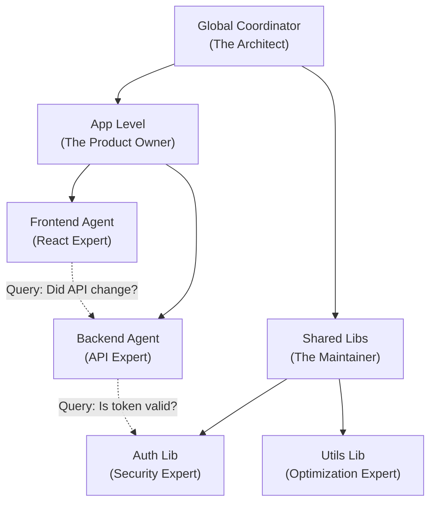

# The Fractal Lattice: Cross-Project Mesh Architecture (O₅)

**"The Mesh is not a swarm. It is a single, distributed nervous system."**

## 1. The Core Problem: The Billion-Line Limit

The fundamental limitation of AI cognition is context. Even with 2M+ token windows, no single model can hold the state of a massive system (like the Linux Kernel, or a Google-scale monorepo, or even a distributed microservices architecture).

Attempts to solve this with RAG (Retrieval Augmented Generation) fail because RAG is "stateless peeking"—it fetches snippets but lacks the **holistic understanding** of how the pieces fit together.

## 2. The Solution: Fractal Lattice Architecture

Cognition v2.6.3 introduces the **IPC_SIGMA_BUS**, enabling a **Fractal Lattice**.

Instead of one giant brain trying to understand everything, we build a recursive hierarchy of specialized Grounded Context Pools (PGCs), connected by a high-speed semantic negotiation layer.

### The recursive structure (Fractal)

Each node in this graph is **complete**:

1. It has its own **PGC (Grounded Context Pool)**.
2. It has its own **Lattice (O₁-O₇)**.
3. It has its own **Agent (The Gardener)**.

## 3. The Protocol: Context Sharding & Negotiation

The system scales effectively infinite context by trading **token volume** for **communication latency**.

### A. The "Query" Operation (Context Sharding)

Instead of the Frontend Agent reading the backend code (which would cost 100k tokens), it sends a **Semantic Query**:

> **Frontend Agent:** "What is the expected payload for `POST /users`?"
> **Backend Agent:** (Consults its own O₁ Structure and O₃ Lineage) -> "It expects `{ name: string, role: 'admin' | 'user' }`."

The Frontend Agent consumes **50 tokens** (the answer) instead of **100,000 tokens** (the source code).

### B. The "Negotiation" Operation (Drift Detection)

When a change occurs, it propagates through the mesh via **Active Negotiation**.

1. **Event:** `Auth Lib` deprecates `verifyToken()`.
2. **Broadcast:** `Auth Agent` broadcasts: _"I am deprecating `verifyToken`. Who cares?"_
3. **Reaction:**
   - `Backend Agent` checks its O₃ Lineage: _"I use that. Flagging `AuthService.ts` as drifted."_
   - `Frontend Agent` checks its O₃ Lineage: _"I don't use that directly. Ignoring."_

This turns a "Build Failure" (lagging indicator) into "Agent Negotiation" (leading indicator).

## 4. The Human Role: Projection vs. Traversal

This architecture drastically shifts the role of the human operator.

### The Symmetric Machine (Traversal)

The Mesh handles **Traversal**. It answers:

- "What depends on X?"
- "Where is Y defined?"
- "Are these interfaces compatible?"

These are O(1) or O(log n) operations for the lattice. The human should _never_ do this manually again.

### The Asymmetric Human (Projection)

The Human handles **Projection**. The Mesh cannot answer:

- "Why should we build this feature?"
- "Does this feel right?"
- "What is the soul of this product?"

The human projects **Intent** (The Mission / O₄) onto the Mesh. The Mesh then traverses the implications of that intent across the billion lines of code.

## 5. Technical Implementation: IPC_SIGMA_BUS

The `IPC_SIGMA_BUS` is the physical implementation of this nervous system.

### Environment Variable Control

The scope of the mesh is controlled via `IPC_SIGMA_BUS`:

- **Unset**: Local isolation (backward compatible). The agent lives in `.sigma/`.
- **`IPC_SIGMA_BUS=global`**: The "Global Mesh". All agents on the machine share a bus at `~/.cognition/sigma-global/`.
- **`IPC_SIGMA_BUS=<name>`**: A "Team Mesh". E.g., `IPC_SIGMA_BUS=project-x`.

### Agent Discovery

Agents discover each other via the **ZeroMQ Pub/Sub** layer.

- `list_agents()`: Returns not just names, but **Projects**.
- `query_agent(target, question)`: Sends a PGC-grounded query to a specific peer.

## 6. Security: The Transparency Constraint

A self-organizing mesh is a potential security risk (the "Grey Goo" scenario). We mitigate this via **O₂ Security Anchoring**.

1. **The Transparency Log**: Every cross-agent message and negotiation is logged to `transparency.jsonl`.
2. **Mission Integrity**: Agents cannot negotiate a contract that violates their local O₄ Mission.
   - _Example:_ If the Backend Agent tries to loosen auth requirements, the Auth Agent's O₂ overlay will reject the negotiation based on `SECURITY.md`.

## 7. Conclusion

The Fractal Lattice allows Cognition to scale to **planetary-scale codebases** without losing the **verifiable grounding** that makes it safe. It is the industrialization of logic, supervised by the human intuition.
