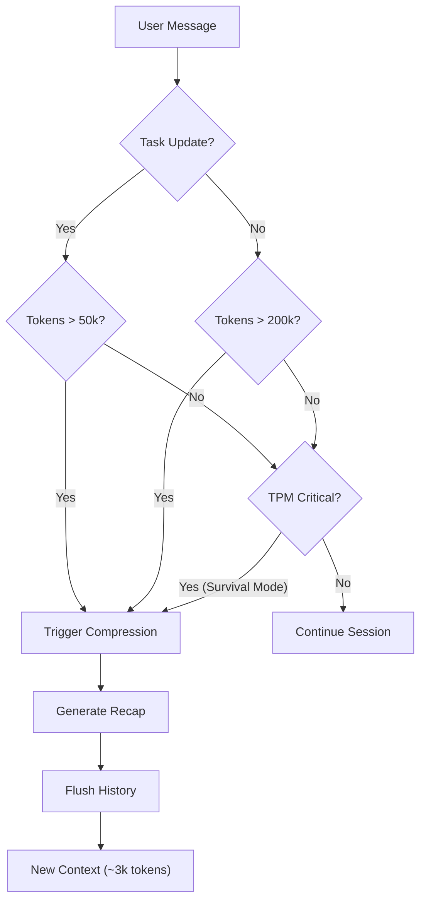

# Token Optimization & Compression Strategy

## Overview

Many powerful reasoning models, including Gemini 3.0 Flash, OpenAI o1/o3, and eGemma, operate under strict **Tokens Per Minute (TPM)** quotas (e.g., 1,000,000 TPM for Gemini). In large-scale coding tasks, simply reading a few files or running a build can spike context usage to 100k+ tokens instantly. If this "context bloat" persists across multiple turns, the session will quickly hit the TPM wall and crash.

To solve this, Cognition Σ implements a **Tri-Modal Compression Strategy**. This system shifts from "reactive" context management to "proactive" pruning, ensuring the agent always operates within a safe TPM envelope across various context-sensitive providers.

---

## The Three Compression Modes

### 1. Semantic Mode (The "Clean Up" Trigger)

**Purpose:** Keeps the context lean by flushing details immediately after a unit of work is finished.

- **Trigger:** The agent uses `SigmaTaskUpdate` to change a task status (e.g., marks a task as `completed`).
- **Threshold:** **> 50,000 tokens**.
- **Min Turns:** **1**.
- **Logic:**
  > "I just finished a task. My short-term memory is full of implementation details (logs, diffs, file reads) that are no longer needed. Since I am at a clean break point, I will compress my history now to free up space for the next task."
- **Surgical Log Eviction (New in v2.6):**
  When a task is marked as `completed`, the provider performs a surgical strike on the session history:
  - **Tool Tagging:** All outputs from `bash`, `read_file`, `grep`, `glob`, and `fetch_url` are automatically tagged with a hidden `<!-- sigma-task: <id> -->` marker.
  - **History Pruning:** The provider scans the session history for any message parts containing this tag.
  - **Archiving:** Evicted logs are not just deleted; they are moved to `.sigma/archives/<session_id>/<task_id>.log` for future reference (auditable via `grep`).
  - **Tombstone Replacement:** Each evicted message is replaced by a concise "Tombstone" (e.g., `[Task <id> completed: output evicted to archive]`). This preserves the conversational structure while reclaiming up to 95% of the task's token footprint.
- **Agent Best Practice:** To maximize efficiency, agents are instructed to mark a task as `in_progress` **before** performing research or running tools. This ensures all implementation and research noise is tagged with the task ID and can be surgically pruned upon completion.
- **Benefit:** Prevents "context drift" and ensures the next task starts with a high-signal, low-noise prompt without losing the ability to audit past work.

### 2. Standard Mode (The "Safety Net")

**Purpose:** Allows for natural conversation and exploration without aggressive pruning, up to a user-defined limit.

- **Trigger:** Standard conversation flow (no Task updates).
- **Threshold:** **> 200,000 tokens** (configurable via `--session-tokens`).
- **Min Turns:** **1** (for Gemini) / 5 (for Claude).
- **Logic:**
  > "I am just chatting, debugging, or exploring files. I will keep the history available so the user can scroll back. However, if I exceed the hard safety limit (200k), I must compress to prevent the session from becoming unmanageable."
- **Benefit:** Preserves conversational continuity during debugging sessions where no formal tasks are being updated.

### 3. Survival Mode (TPM Runway Protection)

**Purpose:** The "Panic Button." Overrides all other rules to prevent a crash.

- **Trigger:** `remaining_tpm < estimated_next_turn_size`.
- **Threshold:** **Dynamic** (Calculated based on real-time quota).
- **Logic:**
  > "I don't care about thresholds or task states. My estimated size for the next turn (current_tokens + overhead) is larger than my remaining TPM budget. If I don't compress NOW, the API will reject my next request."
- **Calculation:**

  ```ts
  estimated_next_turn = current_tokens / max(current_turns, 1);
  safety_margin = 1.2; // 20% buffer
  if (estimated_next_turn * safety_margin > 1_000_000 - current_tokens) {
    FORCE_COMPRESSION();
  }
  ```

- **Benefit:** Guarantees session survival even in extreme edge cases.

---

## Dynamic Thinking Budgeting

To prevent "Thinking Token Bloat" from exhausting the TPM quota, Cognition Σ implements dynamic budgeting for reasoning models (Gemini 3, OpenAI o1/o3, eGemma).

- **Trigger:** Remaining TPM < 200,000.
- **Logic:**
  - **Gemini:** Switches `thinkingLevel` to `LOW` and caps `thinkingBudget` to 8,192 tokens.
  - **OpenAI/eGemma:** Sets `reasoning_effort` to `low` to prioritize speed and token conservation over deep reasoning.
- **Parity:** Both providers use a shared utility (`thinking-utils.ts`) to ensure synchronized behavior across the dual-lattice architecture.

---

## Configuration

### Why `minTurns: 1`?

For Gemini, we set `minTurns` to **1** (down from the default 5).

- **Reason:** Semantic Mode relies on seizing the _exact moment_ a task is done. If the user asks "Fix this bug" and the agent does it in 1 turn (reading 80k tokens of logs), we **must** compress immediately. Waiting for 5 turns would force the agent to carry that 80k noise into the next 4 turns, likely triggering a TPM crash.
- **Safety:** Infinite loops are prevented by the `triggered` state flag. Once compressed, the system locks until the context grows again.

### Default Thresholds (Context-Sensitive Provider Profile)

| Setting             | Value         | Description                                              |
| :------------------ | :------------ | :------------------------------------------------------- |
| `semanticThreshold` | **50,000**    | Aggressive cleanup after task completion (configurable). |
| `tokenThreshold`    | **200,000**   | Relaxed limit for general chat/exploration.              |
| `tpmLimit`          | **1,000,000** | Hard API quota limit.                                    |
| `minTurns`          | **1**         | Allows immediate cleanup after expensive operations.     |

---

## Visual Flow


