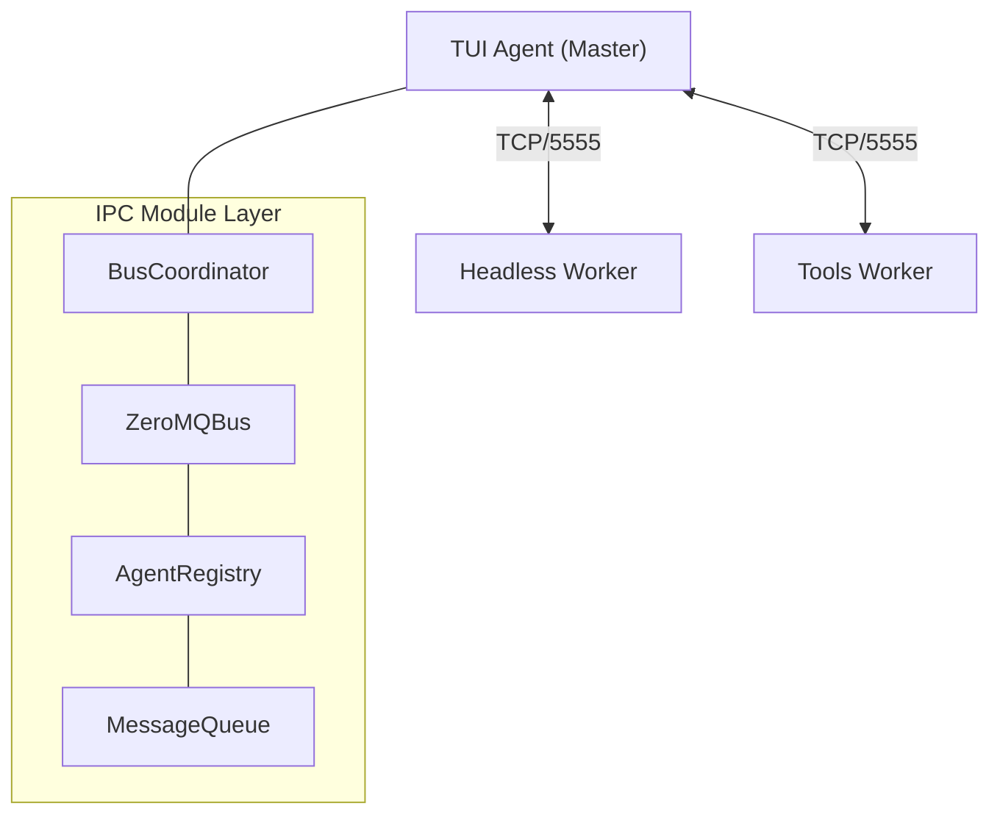

# IPC Module - Multi-Agent Communication Bus

The **IPC (Inter-Process Communication)** module enables different AI agents (TUI instances, headless workers, tools) to discover each other and collaborate in real-time.

It implements a **decentralized message bus** using ZeroMQ, allowing agents to coordinate tasks, share context, and execute complex workflows without a central "brain".

## 🚀 Key Features

- **Zero-Config Discovery**: Agents automatically find the bus master or elect themselves as master.
- **Topic-Based Pub/Sub**: Efficient broadcasting of events (heartbeats, notifications).
- **Direct Messaging**: Reliable 1:1 communication between specific agents.
- **Agent Registry**: Real-time tracking of active agents, their capabilities, and status.
- **Message Queues**: Persistent mailboxes for every agent (file-based backup).

## 🏗️ Architecture

The system is built on a **Brokerless ZeroMQ** architecture with a lightweight coordination layer.



### Core Components

#### 1. ZeroMQBus (`ZeroMQBus.ts`)

The low-level transport layer.

- **Publisher (`PUB`)**: Broadcasts heartbeats and public events.
- **Subscriber (`SUB`)**: Listens for relevant topics.
- **Router/Dealer**: Handles direct request-response patterns (future use).

#### 2. BusCoordinator (`BusCoordinator.ts`)

Handles the "race to become master".

- Tries to bind to port `5555`.
- If successful -> Becomes **Bus Master**.
- If port busy -> Connects as **Peer**.
- Ensures the network always has a hub.

#### 3. AgentRegistry (`AgentRegistry.ts`)

Keeps track of "Who is online?".

- Maintains an in-memory map of active agents.
- Prunes "dead" agents who miss heartbeats (TTL: 30s).
- Exposes `getAgent(id)` and `listAgents()` APIs.

#### 4. MessageQueue (`MessageQueue.ts`)

A file-system backed mailbox for reliability.

- Stores messages in `.sigma/message_queue/<agent-id>/`.
- States: `pending` -> `processing` -> `completed` | `failed`.
- Ensures messages aren't lost if an agent crashes.

#### 5. MessageQueueMonitor (`MessageQueueMonitor.ts`)

The active listener.

- Watches the bus for messages directed at the local agent.
- Writes incoming messages to the `MessageQueue`.
- Emits events (`message`, `countChanged`) for the UI to react.

---

## 📦 Message Protocol

All messages follow the `AgentMessage` interface:

```typescript
interface AgentMessage {
  id: string; // UUID
  from: string; // Sender Agent ID
  to: string; // Recipient Agent ID (or 'all')
  topic: string; // e.g., 'agent.command', 'agent.text'
  timestamp: number;
  content: {
    type: string;
    [key: string]: any;
  };
}
```

### Standard Topics

- `agent.heartbeat`: "I am alive" (broadcast every 5s).
- `agent.message`: Chat message intended for an agent.
- `agent.command`: Instruction to execute a tool/action.
- `agent.notification`: Status update (e.g., "Task started").

---

## 💻 Usage

### Connecting to the Bus

```typescript
import { BusCoordinator, AgentRegistry } from '../ipc';

// 1. Connect (Auto-detects Master/Peer role)
const coordinator = new BusCoordinator();
const bus = await coordinator.connectWithFallback();

// 2. Register Identity
const registry = new AgentRegistry(bus, 'my-agent-id');
registry.register({
  id: 'my-agent-id',
  model: 'claude-3-5-sonnet',
  status: 'idle',
  capabilities: ['code', 'review'],
});
```

### Sending a Message

```typescript
import { MessagePublisher } from '../ipc';

const publisher = new MessagePublisher(bus, 'my-agent-id');

// Send to specific agent
await publisher.sendMessage('target-agent-id', 'Can you review this PR?');

// Broadcast to all
await publisher.broadcast('I am starting a build task...');
```

### Receiving Messages

```typescript
import { MessageQueueMonitor } from '../ipc';

const monitor = new MessageQueueMonitor('my-agent-id', bus, ['agent.message']);
await monitor.start();

// React to new messages
monitor.getQueue().on('countChanged', (count) => {
  console.log(`You have ${count} pending messages!`);
});
```

---

## 🛡️ Resilience & Safety

- **File-Backed Persistence**: Even if the process dies, the `.sigma/message_queue` retains pending messages.
- **Heartbeat Monitoring**: The system self-heals by removing stale peers.
- **Port Fallback**: If `5555` is locked, it gracefully handles connection failures (though currently optimized for single-machine IPC).

---

## 🔮 Future Roadmap

- **Network Bridge**: Extend ZeroMQ over WebSocket for remote collaboration.
- **Shared Memory**: Distributed lattice synchronization via the bus.
- **Swarm Protocol**: Leader election for complex multi-agent tasks.
