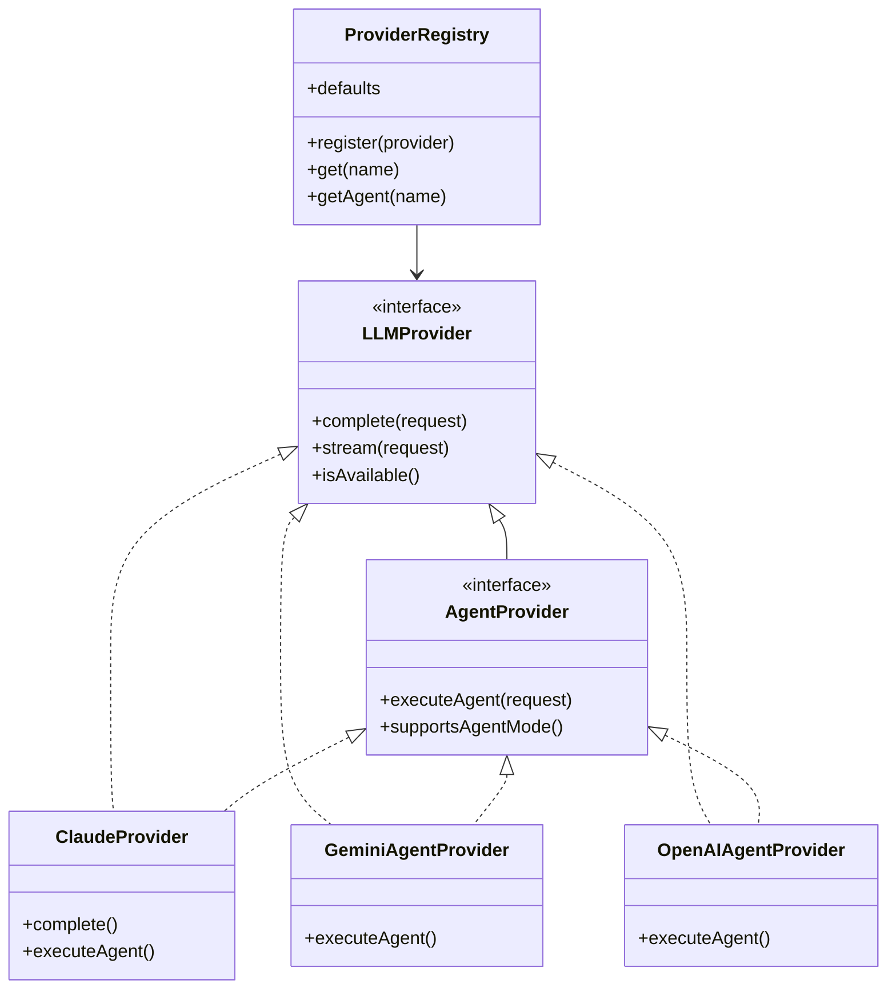

# LLM Module - Multi-Provider Abstraction Layer

The **LLM (Large Language Model)** module provides a unified interface for interacting with different AI model providers (Claude, Gemini, OpenAI/local) within the Cognition system.

It abstracts away the differences between providers, enabling the TUI and other agents to switch models dynamically while maintaining support for advanced features like tool use, streaming, and multi-turn conversations.

## 🚀 Key Features

- **Multi-Provider Support**: Seamlessly switch between Anthropic Claude, Google Gemini, and OpenAI/local models.
- **Unified Interfaces**:
  - `LLMProvider`: Basic completions and streaming.
  - `AgentProvider`: Advanced agent workflows (tools, memory, sessions).
- **Dynamic Registry**: Runtime registration and lookup of providers.
- **ADK Integration**: specialized tooling support for Google's Agent Development Kit (ADK).
- **Configuration Management**: Centralized handling of API keys and model defaults.

## 🏗️ Architecture

The system uses a **Registry Pattern** to manage provider instances, with separate interfaces for basic LLM features and advanced agent capabilities.



### Core Components

#### 1. Core and Interfaces (`core/`, `core/interfaces/`)

- **`LLMProvider`**: The base contract. Every provider must support text completion and availability checks.
- **`AgentProvider`**: Extends the base contract for "Smart" agents. Adds `executeAgent()` which supports:
  - **Tool Use**: Execution of local tools (files, bash, etc.).
  - **Session Management**: Resume previous conversations.
  - **Thinking**: Extended reasoning capabilities (Claude Thinking / Gemini Thinking).

#### 2. Provider Registry (`core/provider-registry.ts`)

The singleton `registry` manages the lifecycle of all providers.

- **Lazy Loading**: Providers are initialized only when needed.
- **Dynamic Defaults**: `getDefault()` returns the configured primary provider. If the default provider is unregistered, the registry automatically falls back to the next available provider.
- **Health Checks**: `healthCheckAll()` verifies connectivity and API key validity.

#### 3. Configuration (`core/llm-config.ts`)

Centralizes settings from environment variables and `settings.json`.

- **Defaults**:
  - Claude: `claude-opus-4-5-20251101`
  - Gemini: `gemini-3-flash-preview`
  - OpenAI: `gpt-4o` (or auto-detected from workbench)

#### 4. Shared Machinery (`core/base-agent-provider.ts`)

Provides a common foundation for all agent-capable LLM providers (Gemini, OpenAI, Claude).
Implements the orchestration logic for agent execution, context gathering, and streaming.

#### 5. Utilities (`core/utils/`)

Extracted shared logic to reduce code duplication:

- **`tool-executors.ts`**: Core execution logic for file operations, bash, etc.
- **`tool-helpers.ts`**: Compression, truncation, and permission helpers.
- **`grounding-utils.ts`**: PGC and cross-session grounding integration.
- **`thinking-utils.ts`**: Dynamic thinking/reasoning budgeting.
- **`eviction-utils.ts`**: Rolling prune and log archiving.

#### 6. OpenAI Agent Provider (`providers/openai/agent-provider.ts`)

Implements the `AgentProvider` interface using the **@openai/agents SDK**.

- Works with official OpenAI API or OpenAI-compatible endpoints (e.g., eGemma workbench).
- Auto-configures from workbench when local chat models (gpt-oss-20b, etc.) are detected.
- Full tool parity with other providers (file operations, bash, memory, IPC).

#### 5. ADK Integration (`providers/gemini/adk-tools.ts`)

Bridges Cognition's internal tool system with Google's **Agent Development Kit (ADK)**.

- Maps `FunctionTool` to Cognition's tool definitions.
- Wraps tools with `onCanUseTool` for safety/permission checks.
- Implements special tools like `recall_past_conversation` and `get_background_tasks`.

---

## 💻 Usage

### 1. Basic Completion (Simple LLM)

```typescript
import { registry } from '../llm';

// Get the default configured provider
const provider = registry.getDefault();

const response = await provider.complete({
  prompt: 'Explain quantum computing in one sentence.',
  model: 'default',
  maxTokens: 100,
});

console.log(response.text);
```

### 2. Agent Workflow (With Tools)

```typescript
import { registry } from '../llm';

// Get a provider capable of agentic workflows
const agent = registry.getAgent('claude'); // or 'gemini'

const iterator = agent.executeAgent({
  prompt: 'Check the disk usage of the current directory',
  cwd: process.cwd(),
  model: 'claude-3-5-sonnet',
  // Enable tools
  onCanUseTool: async (tool, input) => {
    return { behavior: 'allow' };
  },
});

for await (const snapshot of iterator) {
  const lastMsg = snapshot.messages[snapshot.messages.length - 1];
  console.log(`[${lastMsg.role}] ${lastMsg.content}`);
}
```

### 3. Managing Providers

```typescript
import { registry } from '../llm';

// Check what's available
const agents = registry.listAgentProviders(); // ['claude', 'gemini']

// Health check
const isHealthy = await registry.healthCheck('gemini');

// Set a new default
registry.setDefault('gemini');
```

---

## 🛡️ Resilience & Error Handling

The module implements several layers of protection against common AI workflow failures:

- **Missing API Keys**: The registry validates configuration on startup. If a provider lacks keys, it remains unregistered, preventing runtime crashes.
- **Health Checks**: `healthCheckAll()` actively tests connectivity to provider APIs.
- **Rate Limiting**: Providers (specifically Claude) catch `429` errors and expose them gracefully, allowing the TUI to prompt for retry or backoff.
- **Provider Fallbacks**: While `getDefault()` is deterministic, removing a failing provider via `unregister()` triggers an automatic fallback to the next available provider in the list.

---

## ⚙️ Configuration

The module automatically loads configuration from environment variables.

| Provider    | Env Variable             | Description                                            |
| ----------- | ------------------------ | ------------------------------------------------------ |
| **Claude**  | `ANTHROPIC_API_KEY`      | Required for Claude provider                           |
|             | `COGNITION_CLAUDE_MODEL` | Override default model                                 |
| **Gemini**  | `GEMINI_API_KEY`         | Required for Gemini provider                           |
|             | `COGNITION_GEMINI_MODEL` | Override default model                                 |
| **OpenAI**  | `OPENAI_API_KEY`         | Required for official OpenAI API                       |
|             | `OPENAI_BASE_URL`        | Custom endpoint (e.g., local workbench)                |
|             | `COGNITION_OPENAI_MODEL` | Override default model                                 |
| **General** | `COGNITION_LLM_PROVIDER` | Set default provider (`claude`, `gemini`, or `openai`) |

---

## 🔮 Future Roadmap

- ~~**Local LLM Support**: Adapter for Ollama/Llama.cpp to run entirely offline.~~ ✅ **DONE** (OpenAI-compatible endpoint via eGemma workbench)
- **Cost Tracking**: Persist token usage and cost estimates to a local database.
- **Model Router**: "Smart" router that picks the cheapest model for simple tasks and the smartest model for complex reasoning.
- **Prompt Caching**: Abstract provider-specific caching mechanisms (Anthropic prompt caching / Gemini context caching).
