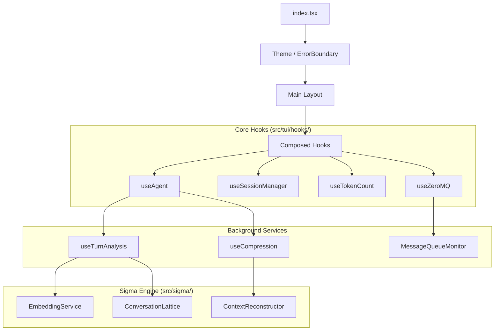

# Cognition CLI - Interactive TUI

**The interface for the post-context era.**

This is the interactive Terminal User Interface (TUI) for Cognition Σ. It is not just a chat interface; it is a **stateful cognitive runtime** that enables infinite context, multi-agent collaboration, and verifiable knowledge evolution.

## 🚀 Key Capabilities

### 1. Infinite Context (The Σ System)

Traditional AI chats forget. This TUI integrates with the **Cognition Σ** engine to maintain a dual-lattice memory structure:

- **Project Lattice (`.open_cognition/`)**: Static knowledge of your codebase.
- **Conversation Lattice (`.sigma/`)**: Dynamic memory of the session.
- **Meet Operation (∧)**: Every turn is analyzed against 7 cognitive overlays (O1-O7) to preserve what matters and discard noise.
- **Intelligent Compression**: At 120k tokens (configurable), the system compresses the conversation into a semantic recap, preserving project-aligned insights while resetting the token count.

### 2. Multi-Agent Bus (IPC)

The TUI acts as a node on the **Cognition IPC Bus** (ZeroMQ).

- **Discover Peers**: Automatically finds other agents running on the bus.
- **Direct Messaging**: Send/receive structured messages to/from other agents.
- **Orchestration**: Can act as a coordinator for background agents.
- **Tools**: Native tools (`send_agent_message`, `list_agents`) allow the AI to proactively collaborate.

### 3. Modular React Architecture

Built with **React** and **Ink**, utilizing a composed hook architecture for stability and testability.

- **Non-blocking Analysis**: Turn analysis runs in a background queue (`useTurnAnalysis`).
- **Async Operations**: Long-running tasks are managed via `BackgroundTaskManager`.
- **Hot Reload**: Supports rapid development cycles.

---

## 🏗️ Architecture

The TUI is built on a **composed hook** pattern, moving away from monolithic controllers.



### Directory Structure

```text
src/tui/
├── components/           # UI Components (Ink)
│   ├── ClaudePanelAgent.tsx  # Main chat area
│   ├── InputBox.tsx          # Multi-line input with history
│   ├── OverlaysBar.tsx       # O1-O7 visualization
│   ├── StatusBar.tsx         # Token & Session stats
│   └── ...
├── hooks/                # Specialized Logic
│   ├── useAgent.ts           # ★ Main Orchestrator
│   ├── analysis/             # Background semantic analysis
│   ├── compression/          # Context compression triggers
│   ├── sdk/                  # Agent Provider Adapters
│   ├── session/              # Session state persistence
│   ├── tokens/               # Token tracking
│   └── useZeroMQ.ts          # IPC Bus integration
├── services/             # Application Services
│   └── BackgroundTaskManager.ts
├── tools/                # TUI-specific MCP Tools
│   ├── agent-messaging-tool.ts
│   └── background-tasks-tool.ts
└── index.tsx             # Entry Point
```

---

## 🐦‍🔥 The Seven Overlays (O1-O7)

Every conversation turn is analyzed across 7 semantic dimensions. This allows the system to "understand" _why_ something was said, not just _what_ was said.

| Overlay | Domain       | Description                                         |
| :------ | :----------- | :-------------------------------------------------- |
| **O1**  | Structural   | Codebase architecture, file patterns, dependencies. |
| **O2**  | Security     | Auth, permissions, data safety, vulnerabilities.    |
| **O3**  | Lineage      | History of changes, git context, "why we did this". |
| **O4**  | Mission      | Project goals, requirements, acceptance criteria.   |
| **O5**  | Operational  | CI/CD, deployment, scripts, dev environment.        |
| **O6**  | Mathematical | Algorithms, invariants, formal logic, proofs.       |
| **O7**  | Strategic    | High-level synthesis, cross-domain connections.     |

---

## 💻 Usage

### Basic Start

```bash
cognition-cli tui
```

### Resume a Session

The TUI uses a **Dual-Identity Session** model:

1. **Anchor ID**: The user-facing ID (stable).
2. **SDK Session ID**: The internal API session (changes on compression).

```bash
# Resume by ID
cognition-cli tui --session-id <session-id>

# Resume from file
cognition-cli tui -f .sigma/<session-id>.state.json
```

### Configuration Options

```bash
# Set compression threshold (default: 120k)
cognition-cli tui --session-tokens 200000

# Enable debug logging (creates tui-debug.log)
cognition-cli tui --debug

# Disable onboarding mode (wizard)
cognition-cli tui --no-onboarding-mode

# Disable auto-response to agent messages
cognition-cli tui --no-auto-response
```

### Slash Commands

- `/send <alias> <msg>`: Send a message to another agent on the bus.
- `/agents`: List all active agents.
- `/pending`: View pending messages in the queue.
- `/inject <id>`: Manually inject a pending message.
- `/login`: Re-authenticate with the LLM provider.

---

## 🤝 Multi-Agent Collaboration

The TUI automatically connects to the ZeroMQ bus if available.

1. **Discovery**: It broadcasts its presence and listens for heartbeats.
2. **Messaging**: Other agents (or CLI instances) can send messages to the TUI.
3. **Notifications**: When a message arrives, a "New messages" notification appears.
4. **Auto-Response**: By default, the agent will see the message and can choose to respond immediately.

---

## 🛡️ Safety & Guardrails

- **Tool Confirmation**: Dangerous tools (file writes, shell commands) prompt for user confirmation.
- **Yossarian Protocol**: Prevents infinite "Thank you" loops between agents by rate-limiting auto-responses.
- **Render Error Boundary**: Gracefully handles UI crashes without killing the process.
- **Signal Handling**: Proper cleanup of ZeroMQ sockets and child processes on `Ctrl+C`.

---

## 🔧 Development

### Adding a New Hook

1. Create the hook in `src/tui/hooks/<domain>/`.
2. Expose it via `index.ts` in that directory.
3. Compose it into `useAgent.ts` (the orchestrator).

### Modifying the Theme

Ink theme definitions are in `src/tui/index.tsx`. We use a custom "AIEcho" theme (Cyan/Green/Purple).

### Debugging

Run with `--debug`.

- **Console**: Logs are dim/hidden to preserve UI.
- **File**: `tui-debug.log` contains detailed traces.
- **IPC**: `src/ipc/monitor-cli.ts` can be used to sniff bus traffic separately.
